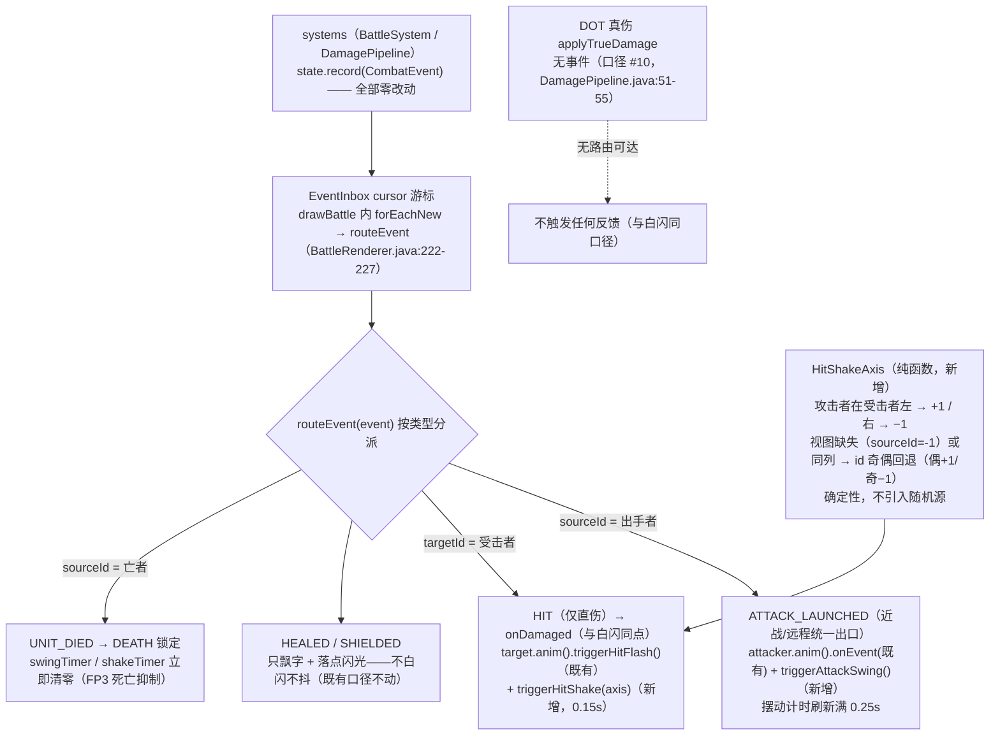
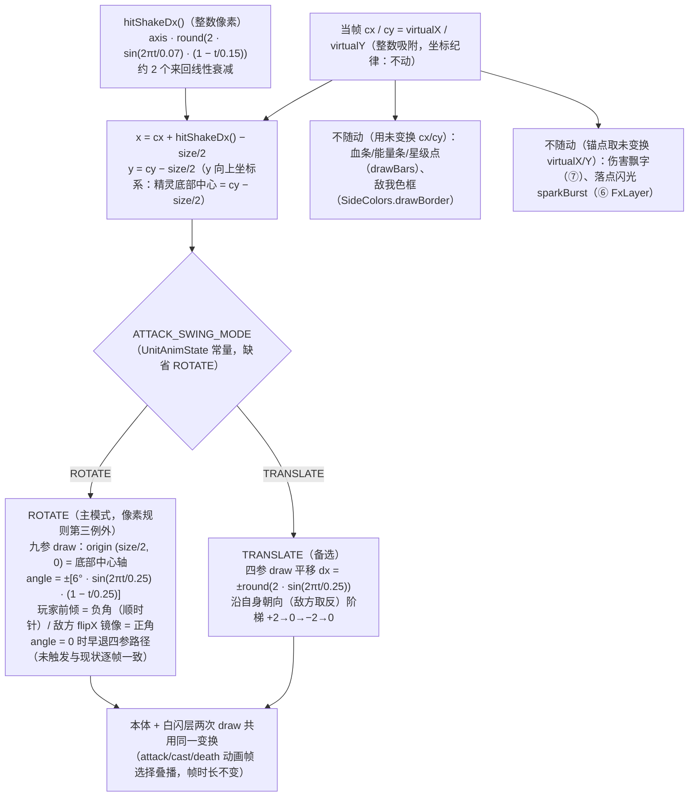

# 攻击/受击动作反馈：事件接线与绘制变换图

> attack_feedback（2026-08-23）：出手底部中心轴小幅摆动 + 受击整数像素抖动（纯表现层叠加，零逻辑改动、零新增素材）。
> 浏览器查看版：`attack_feedback_event_transform.html`（双击打开）
> 依据：计划 `docs/spec_plan/2026-08-23_attack_feedback.md` §5/§6；`attack_feedback_design.md` FP1~FP3；render_design V1.4 §一#7 / §5.1 / §5.3 / §八#3

## 1. 事件接线与抑制（BattleRenderer.routeEvent / onDamaged，两处既有 case 内各追加一行）

## 2. UnitView.draw 本体绘制变换合成（render §3.2 层序 ④ 棋子本体；白闪层共用同一变换）

## 3. 约束与边界

| 约束 | 出处 |
|------|------|
| 纯表现层：CombatEvent / BattleSystem / DamagePipeline / systems / data 零改动，只消费既有事件 | attack_feedback §2 成功标准 |
| 像素规则：禁旋转新增第三例外「攻击摆动小幅旋转（仅默认模式，底部中心轴 ≤8°、~0.25s）」；TRANSLATE 备选仍整数像素 | render V1.4 §一#7 / §八#3（2026-08-23 裁决 C 方案） |
| CAST 不触发摆动（已有起手闪光 + cast 动画）；施法中摆动不抑制（叠加层播完） | attack_feedback FP1 / FP3 |
| 近战不重复触发：摆动只认 ATTACK_LAUNCHED；HIT 的攻方动画路由保持现状 | attack_feedback FP1 |
| 死亡抑制：DEATH 锁定立即清零两计时；死后触发调用被忽略——不与缩放淡出叠加 | attack_feedback FP3 |
| DOT（POISON/BLEED 心跳）无事件不抖；HEALED/SHIELDED 不抖（正面反馈与白闪同口径） | attack_feedback §7 / FP2 |
| 渲染段零分配：每单位新增 2 个 float 计时器 + 1 个 int 轴，无对象创建 | attack_feedback §4 |
| 幅度常量归零 → 画面与现状逐帧一致（可完全关断）；模式常量一键切 ROTATE/TRANSLATE | attack_feedback §2 / 裁决 C |
| 零新增素材：素材 key 总量 201 不变 | art_asset_spec §4.5 / §7 |
