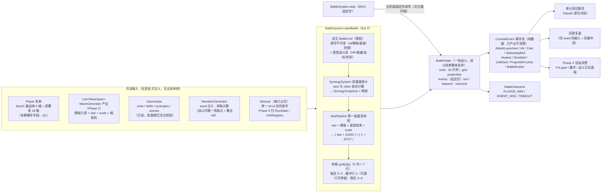

# 战斗状态数据流图（Phase 3）

> 开战输入 → `BattleSystem.startBattle` 派生 → `BattleState`（一场战斗的受控可变状态）→ `CombatEvent` 事件流（正式产出）。
> 浏览器查看版：`battle_dataflow.html`（双击打开）
> 依据：`architecture_design.md` §二（双实体 / 所有权地图 / 三层不可变）、§六（RNG 消耗点）；`battle_design.md` §二（事件流）；Q1 裁决（交付物按出生表 + 发号器接口占位）

## 边界与约束

| 约束 | 出处 |
|------|------|
| `BattleUnit` 战斗作用域内受控可变、出作用域即弃（不可变优先的显式例外） | architecture §2.4 第三层 |
| 棋盘占位归 `BattleState`，不归 `Player` | GDD §10.2 注 / architecture §2.3 |
| 战斗内 RNG 消耗仅暴击判定一点（发射序消耗） | architecture §六 |
| `Unit`（名单）绝不被战斗污染——战斗只读名单派生新实例 | architecture §2.1 |
| 逻辑层只产出事件；渲染/测试/回放是消费者 | battle §二 |
