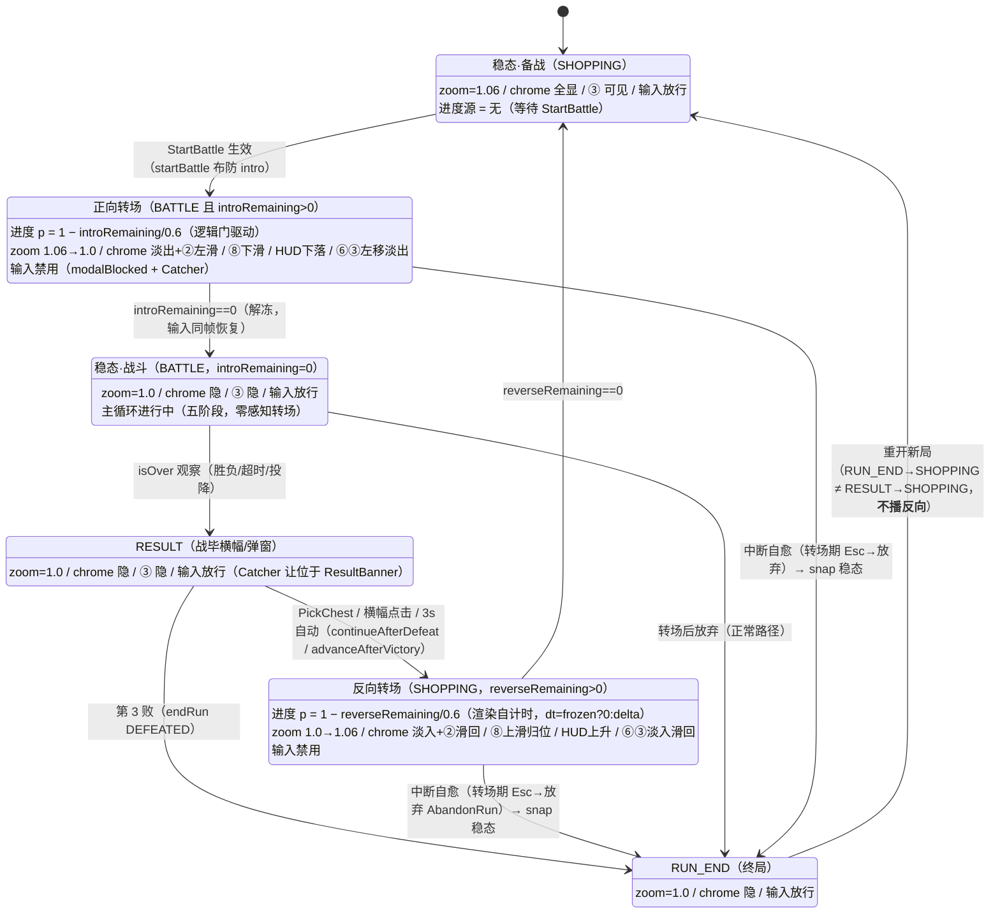

# 开战转场「清场入阵」驱动器状态机（battle_intro_transition_flow）

> **版本**：V1.0（2026-09-09）——`docs/spec_plan/2026-09-09_battle_intro_transition.md` §5 配图。
> **依据**：`battle_design.md` V1.8 §二开战转场（Q1 BLOCKER 裁决 **A——就地适配**：⑧ 底部下滑 / HUD 顶部下落，「交接同一槽位」废弃）；`render_design.md` V1.6 §5.6。
> **可交互版**：`battle_intro_transition_flow.html`（本文件同目录，浏览器打开）。

## 一、驱动器状态机（BattleTransitionController）

正向进度由**逻辑冻结门**驱动（`introRemaining` 归一化），反向由**渲染侧自计时**驱动——两段非对称是设计核心：



## 二、双域姿态表（进度 p: 0→1，位移取整吸附；zoom 例外）

| 域 | 元素 | 正向（p: 0→1） | 反向（p: 0→1） | 稳态所有者 |
|---|---|---|---|---|
| UI | ⑧ 商店栏（底部条带） | 下滑离场：y = −72×p（裁决 A） | 自底缘上滑归位：y = −72×(1−p) | Screen 相位行（转场窗控制器接管可见性） |
| UI | 战斗 HUD（顶部） | 上缘外下落就位：y = +72×(1−p) | 上升退场：y = +72×p | 同上 |
| UI | ⑥ 开战按钮（组位移） | 左移 + 淡出：x = −140×p，a = 1−p | 淡入 + 滑回：x = −140×(1−p)，a = p | 同上 |
| UI | ③ 背包（组位移） | 左滑 + 淡出（同 ⑥） | 滑回 + 淡入（同 ⑥） | **控制器常驻**（仅 SHOPPING 可见，K7） |
| UI | ⑤ 羁绊面板 | 不动（既有 phase 联动置暗 0.35，无渐变） | 不动 | SynergyPanel.draw |
| UI | ⑨ 通知 / 顶栏 | 不动 | 不动 | — |
| UI | 全屏 Catcher | 显示（吞 UI 点击） | 显示（吞 UI 点击） | 隐（不可见 Actor 不参与 hit 测试） |
| 棋盘域 | ② 备战席（槽+席上棋子） | 左滑：x = −140×p | 滑回：x = −140×(1−p) | BattleRenderer.drawShopping |
| 棋盘域 | ⑦ 出售区 / 布阵提示 | 淡出：a = 1−p | 淡入：a = p | 同上 |
| 棋盘域 | 敌阵虚影 | 淡出（实体化一拍——实体单位同位置就位） | 淡入（下轮侦察） | 同上 |
| 棋盘域 | 玩家部署帧 | **不画**（UnitView 已就位，防叠影——K5） | 随 a 淡入 | 同上 |
| 镜头 | worldCamera.zoom | 1.06 → 1.0（线性） | 1.0 → 1.06（线性） | 控制器常驻（SHOPPING=1.06，其余=1.0） |

## 三、数据流与确定性

```
逻辑域（每 LOGIC_STEP）                     渲染域（每帧）
─────────────────────────                  ─────────────────────────
StartBattle → startBattle                  render(delta):
  → beginIntro(0.6s)                         frozen = paused||dialog
step:                                        controller.update(phase, intro, frozen?0:delta)
  intro>0 → advanceIntro(step); return         ├ 正向 = intro 归一化（随 ×2 快进/冻结自动正确）
  （elapsed/RNG/事件/计时器/能量全冻结）        ├ 反向 = 自计时（dt 驱动）
  intro==0 → 五阶段主循环                      └ 写 camera.zoom（先于 viewport.apply）
                                             battleRenderer.draw(…, benchOffsetX, chromeFadeAlpha)
                                             （相位可见性行）
                                             controller.applyUiPose()  → uiStage.draw
```

- 转场**零 RNG / 零 CombatEvent / 零 elapsed**（battle §二冻结清单）→ 确定性回放与存档不包含它；快照仅 SHOPPING 稳态写，续玩落地稳态不播转场。
- 软回滚：`BATTLE_INTRO_TRANSITION_SECONDS = 0f`（转场+输入禁用即关）、`SHOPPING_CAMERA_ZOOM = 1f`（回正即关）。
