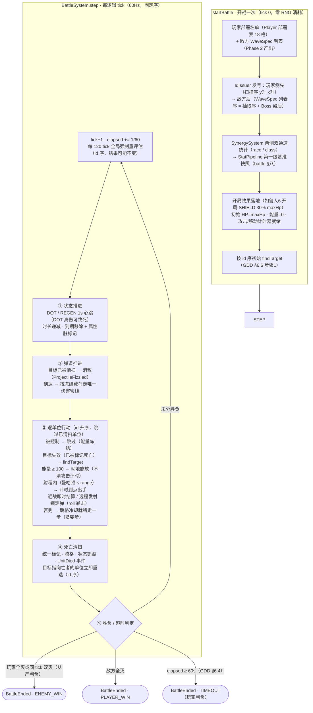

# 战斗主循环流程图（Phase 3）

> `BattleSystem.startBattle`（开战一次）与 `step`（60Hz 固定序五阶段）的全流程。
> 浏览器查看版：`battle_main_loop.html`（双击打开）
> 依据：`battle_design.md` §二（H 语义）/§五/§六；实现层口径见 `docs/spec_plan/2026-08-21_phase3_battle_engine.md` §三（#2 弹道相位插入、#3 互斥行动链、#15 判定序）

## 关键语义（H 语义，battle §二）

- **伤害立即落地**：结算点当场扣 HP，后行动者看到的是最新血量（治疗能奶到本 tick 刚被打残的人）。
- **死亡延迟清算**：HP ≤ 0 但尚未清扫的单位在本 tick 仍是合法目标、仍可行动——互秒与"濒死反打"自然发生。
- **同 tick 冲突一律由固定遍历序 + id 决胜**：确定性回放的根基（发号序 = 玩家先、敌方后，见实现层口径 #16）。
- **事件即产出**：每个结算点记录纯数据 `CombatEvent`，逻辑层只产出、不消费。
