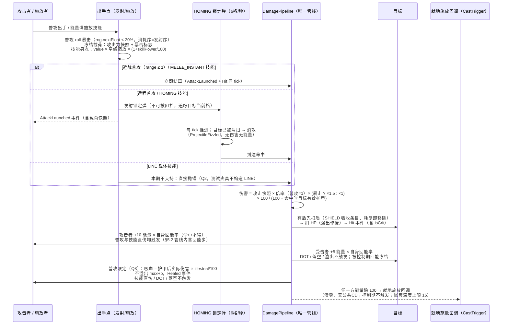

# 伤害管线序列图（Phase 3，唯一管线）

> 普攻与技能直伤共用的结算序列：发射冻结 → 载体投送 → 命中结算（护甲 → 盾 → HP → 回能 → 吸血）。
> 浏览器查看版：`damage_pipeline.html`（双击打开）
> 依据：`battle_design.md` §5.2 / §5.3 / §六；Q2 裁决（LINE 本期不做）；Q3 裁决（吸血仅普攻直伤触发）

## 附：不走本管线的结算

| 结算类型 | 通路 |
|----------|------|
| DOT（BLEED/POISON）每跳 | `DamagePipeline.applyTrueDamage`：无视护甲（真伤可致死）、先扣盾、无回能无吸血 |
| 治疗 / 护盾量 | `applyHeal` / SHIELD 吸收条目：maxHp × value × 星级缩放 × (1+skillPower/100)，溢出作废 |
