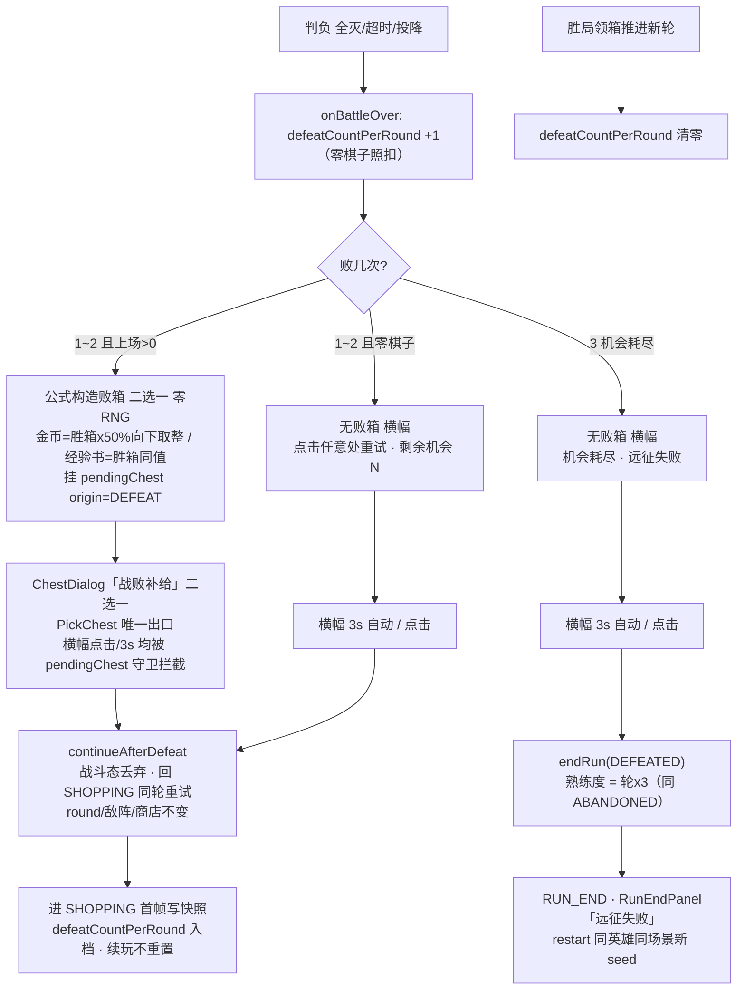

# 判负三分岔流程（每轮 3 次机会制，GDD V0.15 §2.2）

> 归属：`docs/spec_plan/2026-08-24_defeat_chest_economy_pack.md` §5 / CP15 ｜ 日期：2026-08-24
> 机会上限 `GameBalance.DEFEAT_LIMIT_PER_ROUND = 3`（工作值待调）；判负成因 = 全灭 / 超时 / 投降（同口径）。

## 分岔矩阵

| 判负时状态 | 机会计数 | pendingChest | RESULT 出口 | 去向 |
|---|---|---|---|---|
| 上场 > 0，第 1/2 败 | +1（→1 或 2） | 败箱二选一（零 RNG） | PickChest（唯一出口） | 回 SHOPPING 同轮重试 |
| 零棋子，第 1/2 败 | +1（→1 或 2） | null | 横幅 3s / 点击 | 回 SHOPPING 同轮重试 |
| 任意（含零棋子/投降），第 3 败 | +1（→3） | null | 横幅 3s / 点击 | endRun(DEFEATED) → RUN_END |
