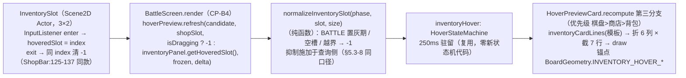
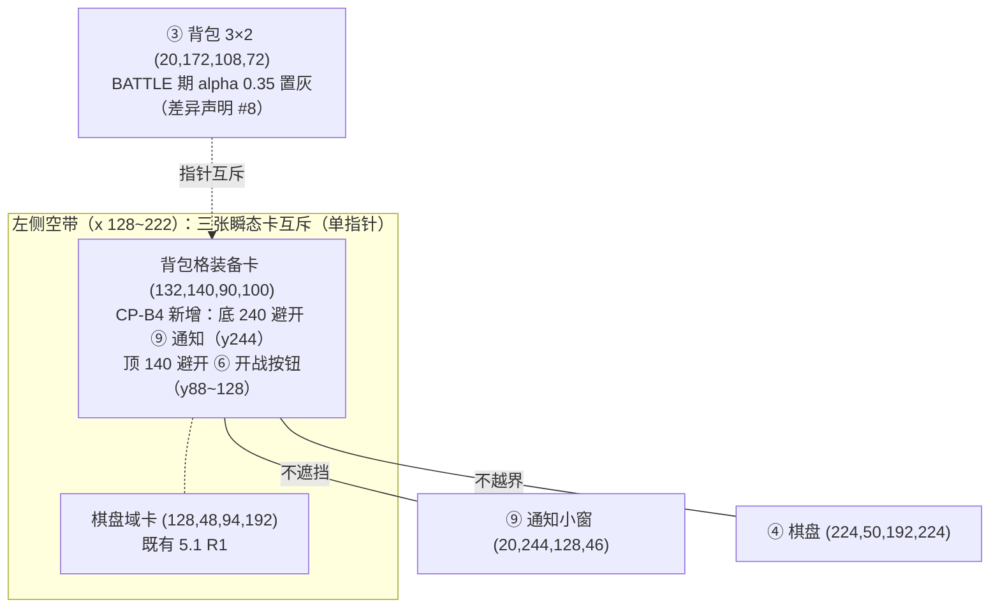

# feedback07 装备效果三展示点数据流图

> feedback07（2026-08-22）：数据层完备（effects + passiveStatus）但全 UI 无处查看装备效果——三展示点接入，共用同一文案源。
> 浏览器查看版：`feedback07_equipment_effect_view.html`（双击打开）
> 依据：计划 `2026-08-22_feedback06_event_subject_and_equipment_effect_view.md` §5.2/§6.CP-B1~B5；GDD §5.2；data_schema §八

## 1. 单一文案源 → 三展示点（禁止三处各写一份格式化）

```mermaid
flowchart TB
    DATA["EquipmentData（不可变模板，equipments.json 8 条）<br/>effects: List&lt;EquipmentEffect{stat,op,value}&gt;<br/>passive: EquipmentPassive{type,power,tickInterval} 可 null<br/>（本期 passive 仅 REGEN——JsonLoader.java:477 加载期限制）"]

    EIT["EquipmentInfoText（CP-B1 新建；纯函数，headless 可测）<br/>词表复用 UnitInfoText.statLabel / numberText（同包）<br/>effectText：PCT → 标签+v%；ADD → 标签+v（百分比刻度键附 %）<br/>passiveText：\"被动：每 N 秒 回复 P% 最大生命\"（GDD §5.2 龙心行原文对齐）<br/>effectEntries（逐条目）/ effectSummary（· 连接单串）/ lines（名+稀有度·槽位+条目）"]

    DETAIL["① UnitDetailDialog 装备行（CP-B2）<br/>UnequipButton 右侧效果列：effectSummary 折行 12 列 × 截 2 行<br/>构造期预计算（重建指纹不变，feedback04 机制零破坏）"]
    HOVER["② InventoryPanel 背包格悬停卡（CP-B3/B4）<br/>InventorySlot enter/exit → hoveredSlot（沿 ShopBar 先例）<br/>HoverPreviewCard 第三源 inventoryHover（250ms 驻留复用）<br/>lines 逐行折 6 列 × 截 7 行；锚点 (132,140,90,100)"]
    CHEST["③ ChestDialog 宝箱选项行（CP-B5）<br/>effectEntries 逐条折 8 列 × 截 3 行<br/>optionText（名）/ 传说金棕底色均不变"]

    DATA --> EIT
    EIT -->|"effectSummary"| DETAIL
    EIT -->|"lines"| HOVER
    EIT -->|"effectEntries"| CHEST
```

## 2. 背包格悬停源链（与棋盘/商店双源同一套状态机）



## 3. 锚点布局（640×360 虚拟坐标，feedback07 新增 ⑩）



## 4. 边界与约束

| 约束 | 出处 |
|------|------|
| 三展示点共用 EquipmentInfoText 单一文案源，禁止各写一份格式化 | 用户裁决（feedback07） |
| R1「棋子悬停卡不含已穿装备」口径指 UnitInfoText.previewLines（模板级棋子卡）；背包格装备卡是另一展示点（装备本体），两者不冲突 | 计划 §5.2 差异声明 / UnitInfoText.java:93 |
| BATTLE 期背包悬停卡抑制：置灰 = 非交互只读快照（差异声明 #8），且效果信息在宝箱/详情已有承载 | 计划 §5.3-B4（本次裁定） |
| 拖拽中抑制背包悬停（BattleScreen 传 -1）：拖拽经 boardProcessor，uiStage enter/exit 仍会触发，查询侧归一 | 计划 §5.3-B4 |
| passive 语义：REGEN power = maxHp 比例/跳、tickInterval = 秒/跳（StatusSystem 心跳落地，BattleSystem.applyEquipmentPassives 开局挂载） | data_schema §八 / StatusSystem.java:100-103 / BattleSystem.java:255-267 |
| 装备行效果列为纯文本追加绘制，不触碰按钮命中域与重建指纹（feedback04 实例保留机制） | UnitDetailDialog.java:84-104 |
