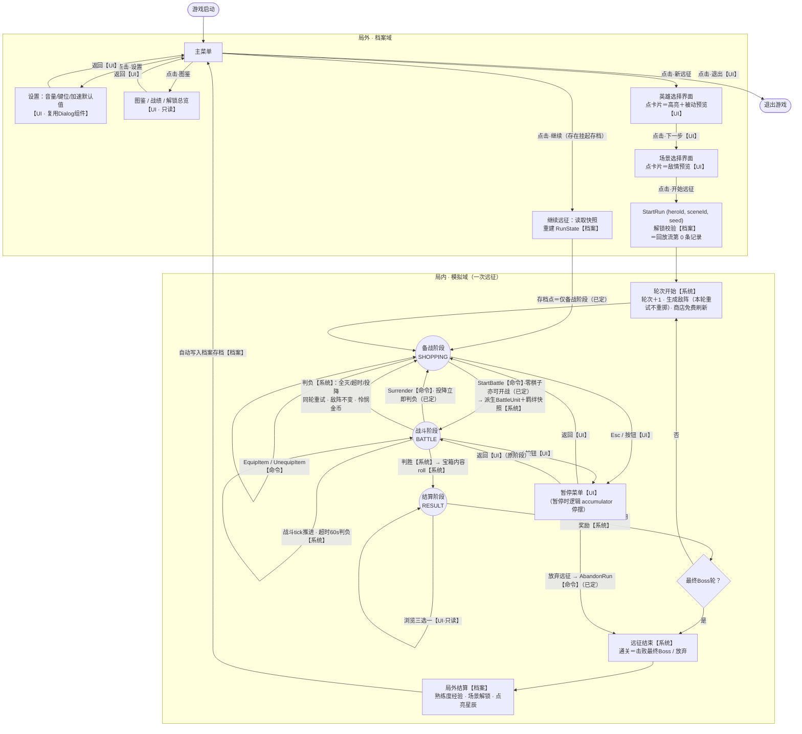

# 游戏交互流程图（V0.2，待定项已全部裁决）

> 启动 → 局外选择 → 局内循环（备战 / 战斗 / 结算）→ 远征结束的全交互地图。  
> 浏览器查看版：`interaction_flow.html`（双击打开）  
> 裁决依据：GDD V0.6 决策日志、`architecture_design.md` §九

**标注图例**：【命令】局内命令（入队、tick 消费、可回放）｜【档案】档案域操作（持久化、无回放）｜【UI】纯界面交互（不产生命令）｜【系统】确定性自动反应（非命令）

## V0.1 挂起项的裁决结果（2026-08-20，全部定案）

| 原待定项 | 结论 |
|----------|------|
| `Surrender`（投降） | **保留**：战斗中随时投降，立即判负原地重试 |
| `AbandonRun`（放弃远征） | **保留**：备战/战斗阶段经暂停菜单触发，按波数结算熟练度 |
| 每轮开始商店免费刷新 | **有**：新轮进入备战时触发；重试不触发 |
| 装备合成 | **MVP 无合成**：宝箱直接给成品（图按无合成绘制，无 CombineEquipment 命令） |
| 零棋子开战 | **允许**：StartBattle 无前置校验 |
| 存档点约束 | **仅备战阶段可挂起存档** |
