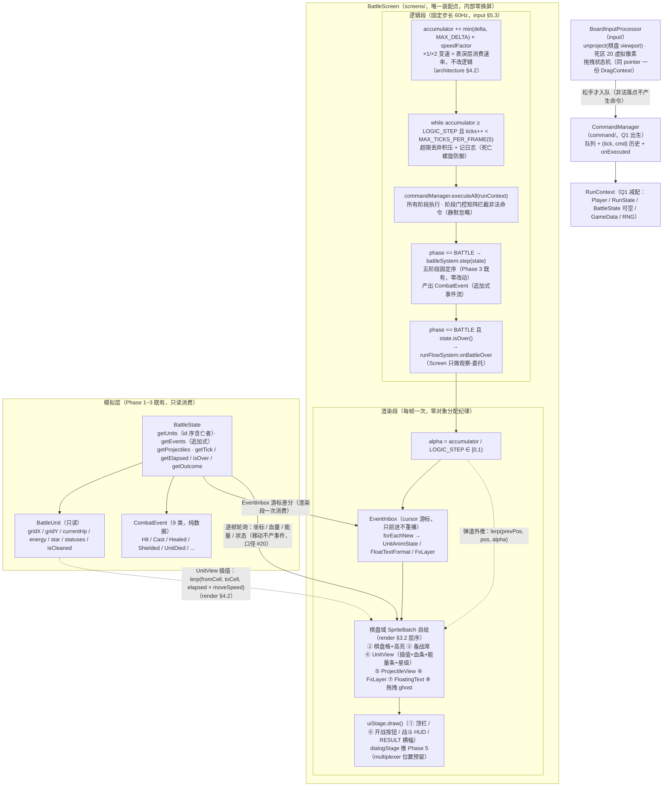

# Phase 4 帧循环与双通路渲染架构图

> `BattleScreen.render(delta)` 的逻辑段 / 渲染段两段式结构，与双通路（棋盘域自绘 × UI 域 Stage）的数据流。
> 浏览器查看版：`phase4_render_architecture.html`（双击打开）
> 依据：`render_design.md` §三（双通路）/§四（帧循环与插值）/§5.1（动画 FSM）；`user_input_design.md` §5.3（固定步长消费）；Q1/Q2/Q3/Q4 裁决（2026-08-22）

## 边界与约束

| 约束 | 出处 |
|------|------|
| 渲染只读模拟层：`entities/ data/ systems/` 禁 import 渲染类与 `Gdx.*` | project_structure §四 |
| 逻辑 tick 产出的 CombatEvent 进帧事件缓冲，渲染段一次性消费、不重播 | render §4.3（cursor 实现见差异声明 #2） |
| 变速 / 暂停是表演层（accumulator 消费速率），不进命令不改逻辑 | architecture §4.2 |
| 渲染与占位资源生成禁止触碰模拟 `RandomGenerator`（配色用 FNV-1a 纯 hash） | architecture §六 / 本期口径 #14 |
| UnitView 等战斗视图生命周期 = BattleState（一场战斗整体销毁重建） | render §六视图铁律 3 |
| 渲染段零对象分配（池获取除外）——事件消费走 cursor + 回调，events 视图只取一次 | render §八.6 |
