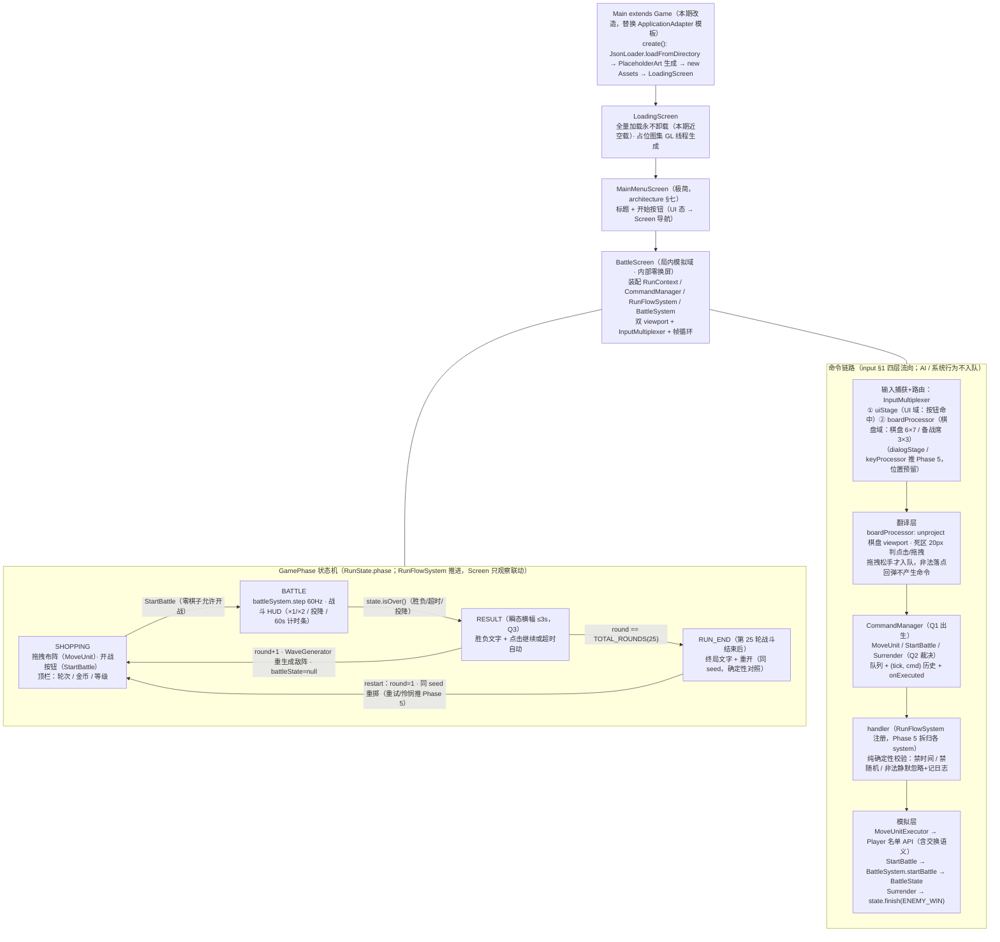

# Phase 4 Screen 流转与命令链路图

> Main(Game) → 三 Screen 导航（浅图，无导航栈框架）× GamePhase 逻辑状态机（BattleScreen 观察并联动 UI）× 玩家操作命令链路。
> 浏览器查看版：`phase4_screen_flow.html`（双击打开）
> 依据：`architecture_design.md` §五（阶段状态机）/§七（Screen 架构）；`user_input_design.md` §2.2（multiplexer）/§2.4~2.5（手势与归属）；Q1~Q4 裁决（2026-08-22）

## 边界与约束

| 约束 | 出处 |
|------|------|
| SHOPPING / BATTLE / RESULT 是逻辑状态机的状态，由 BattleScreen **观察**并切换 UI 可用性，不是 Screen | architecture §七 |
| 命令只承载玩家输入（纯数据，禁 run/execute 方法）；系统行为（阶段推进/轮开始/演示名单）不入队 | input §4.1 / §7.1~7.2 |
| Screen 只做点火器：初始化 multiplexer + render 里 executeAll，业务判断不写在 Screen | input §7.3 |
| 拖拽永不跨域：棋盘/备战席归 boardProcessor，按钮归 uiStage；跨域交互退化为点击 | input §2.5 |
| 判负同轮重试 + 怜悯推 Phase 5：本期胜负统一推进轮次（差异声明 #6） | Q3 裁决 / architecture §5.1 |
| 6 Screen 中 Loading / MainMenu(极简) / Battle 本期出生；RunSetup / Codex / RunResult 推 Phase 5~6 | architecture §七 |
