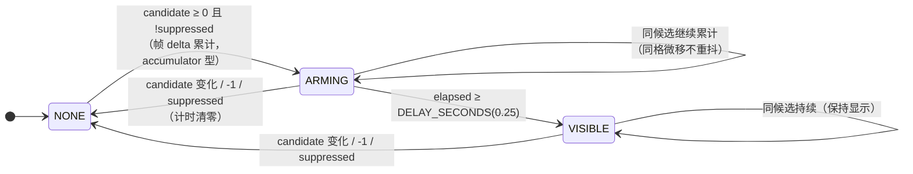
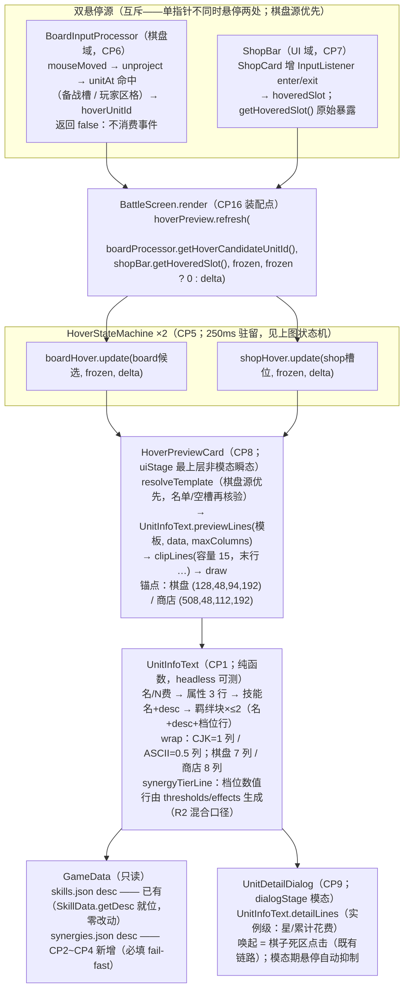

# Phase 5.1 悬停状态机与预览数据流图

> 裁决 1（2026-08-22）= A 固定锚悬停卡：悬停 ~250ms 显示、不跟随鼠标、固定卡位、只读精简、拖拽中与模态期抑制、与详情弹窗共用格式化函数。
> 浏览器查看版：`phase5.1_hover_flow.html`（双击打开）
> 依据：`2026-08-22_phase5.1_ui_polish_brief.md` R1；`user_input_design.md` §2.4（Tooltip/选中态）；计划 `2026-08-22_phase5.1_ui_polish.md` §5.1/§5.3-2/§5.3-8

## 1. 悬停驻留状态机（HoverStateMachine，每源一实例）

抑制条件的施加位置（集中两处，状态机只认 candidate 与 suppressed）：

| 源 | 归一位置 | 条件 |
|----|----------|------|
| 棋盘域 | `BoardInputProcessor.getHoverCandidateUnitId()`（CP6） | 拖拽中 `isDragging()` / `modalBlocked` / 非 SHOPPING / 名单核验 `getUnitById`（悬停中被卖出/合并 → -1） |
| 商店卡 | `HoverPreviewCard.refresh` 归一（CP8） | 非 SHOPPING / 空槽（`slotAt==null`）/ `suppressed` |
| 两源共用 | `BattleScreen.render` 传 `frozen`（CP16） | `frozen = paused || UIDialogManager.isShowing()`（与模拟冻结同源；冻结帧 delta 传 0） |

## 2. 预览数据流（输入 → 状态机 → 卡 → 格式化 → 数据）

## 3. 边界与约束

| 约束 | 出处 |
|------|------|
| 悬停只读、模板级（不含 spend/已穿装备）；实例级信息走点击详情弹窗 | 简报 R1 / 裁决 1 |
| 计时为表现层 accumulator（帧 delta），不进 stepSimulation 固定步长、不进命令队列、零 RNG | architecture §4.2 同类口径 / 计划 §5.3-2 |
| 悬停卡非模态：无输入监听、不阻断任何交互（区别于 dialogStage 弹窗族） | 计划 §5.1 |
| 双源互斥 + 棋盘源优先（单指针物理不可能同时命中两源，优先级为防御性定义） | 计划 §5.1 |
| 行集/折行/截断全部纯函数化（wrap/clipLines/synergyTierLine），绘制层零策略 | TDD 约束 / 计划 §6.CP1 |
| CJK 降级：缺字体回退时中文不渲染但不炸（不维护双语表） | 计划 §5.3-6 / 裁决 3 |
