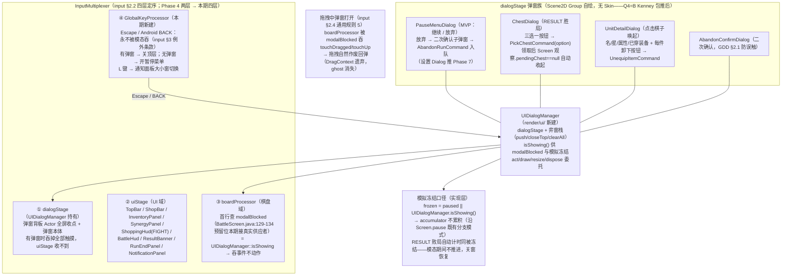

# Phase 5 暂停菜单 / dialogStage 模态阻断链图

> Q5 裁决：RunResultScreen / CodexScreen / 存档推 Phase 6；本期做暂停菜单（MVP=继续/放弃）+ dialogStage + GlobalKeyProcessor（Escape/BACK 永可达）+ AbandonRun 二次确认。
> 浏览器查看版：`phase5_dialog_modal_chain.html`（双击打开）
> 依据：`user_input_design.md` §2.2（multiplexer 四层）/§3（模态穿透陷阱：Escape/BACK 例外）/§2.4（AbandonRun 二次确认）；`render_design.md` §九（弹窗层级 = 输入优先级）；`architecture_design.md` §七（两类永不做 Screen：弹窗归 Dialog）

## 弹窗生命周期与状态一致性

| 弹窗 | 开 | 关 | 数据一致性 |
|------|----|----|-----------|
| PauseMenuDialog | Escape/BACK（无弹窗时）或 TopBar 暂停按钮 | 继续 / Escape / BACK | 只读 RunState；放弃经命令队列结算（UI 不直改状态） |
| AbandonConfirmDialog | 放弃按钮 | 确认（入队 AbandonRun）/ 取消 | 确认后 handler 置 RUN_END，Screen 观察切 RunEndPanel |
| ChestDialog | Screen 观察 phase==RESULT 且 pendingChest!=null 时 push 一次 | 领取后 pendingChest==null → pop（Screen 观察） | 选项内容进 RESULT 时已 roll 好（architecture §4.1），弹窗只读 offer |
| UnitDetailDialog | 棋盘域死区内松手（点击）且无装备待定态 | 关闭按钮 / Escape / BACK | 展示期名单可能变化 → 每帧 refresh；卸下走命令 |

## 边界与约束

| 约束 | 出处 |
|------|------|
| 弹窗/面板/对话框永不做 Screen（归 dialogStage） | architecture §七 |
| 弹窗层级与输入优先级一致：dialogStage > uiStage > boardProcessor > keyProcessor | render §九 / input §2.2 |
| Escape/BACK 是唯一穿透模态的键：有弹窗关顶层、无弹窗开暂停 | input §3 模态陷阱防御 |
| 拖拽中弹窗打开 → 立即取消拖拽回弹 | input §2.4 规则 5（boardProcessor 首行吞事件自然实现） |
| 暂停 = 表演层（accumulator 冻结），不改逻辑状态 | architecture §4.2 |
| AbandonRun 在 SHOPPING/BATTLE 合法；RESULT 期不合法（胜局必须领箱、败局走继续） | 门控矩阵 + 本期实现口径 |
| 设置 Dialog 推 Phase 7；暂停菜单 MVP = 继续/放弃 | Q5 裁决 |
