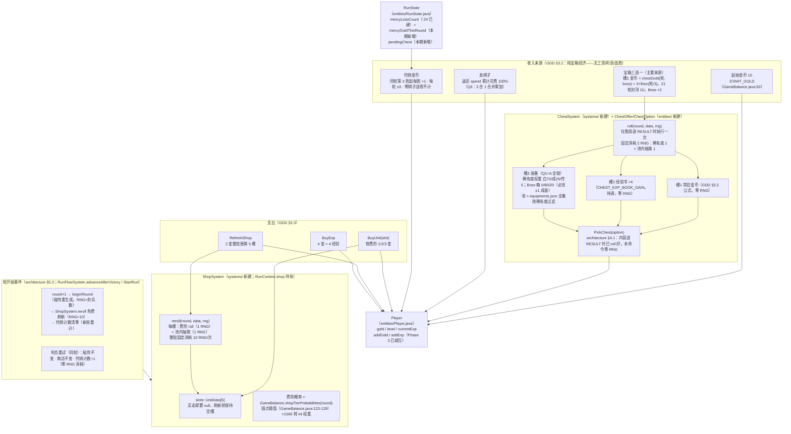

# Phase 5 商店 / 经济 / 宝箱数据流图

> 经济域全链：商店槽位状态（ShopSystem）× 纯宝箱经济收支（GDD §三）× 宝箱三选一（Q2 裁决 A：文档定最小可玩规则）× 怜悯保底。
> 浏览器查看版：`phase5_economy_dataflow.html`（双击打开）
> 依据：`gdd_idea_0.0.0.1.md` §三（纯宝箱经济）/§5.2（掉落权重骨架）；`architecture_design.md` §四/§5.3（轮开始事件）/§六（RNG 消耗点）；Q1/Q2/Q6 裁决（2026-08-22）

## RNG 消耗点口径（architecture §六第 2/3 点本期落地，清单不新增类目）

| 消耗点 | 每次消耗 | 触发时机 | 出处 |
|--------|---------|---------|------|
| 敌阵生成 | = 杂兵数 | 轮开始（beginRound） | Phase 2 既有 |
| 商店刷新 | 固定 10（2/槽 × 5） | StartRun / 新轮进入（免费）+ RefreshShop（2 金） | 本期落地 |
| 宝箱 roll | 固定 2（稀有度 1 + 池内抽取 1）；败局 0 | 胜局进 RESULT 一次性 | 本期落地 |
| 暴击判定 | 1/次普攻 | 战斗内固定行动序 | Phase 3 既有 |

> 固定消耗规则：槽池为空也照常消耗（BuyUnit 槽位无效与池内容无关），保证同 seed 同数据集消耗序确定；内容版本变更会改变具体消耗结果但不破坏确定性本身。

## 边界与约束

| 约束 | 出处 |
|------|------|
| 金币唯一货币，无生命值 / 无利息 | GDD §三 / §10.2 注（决策 2026-08-19） |
| 商店免费刷新是系统行为不入命令队列；轮内主动刷新才走 RefreshShop | GDD §3.4 / architecture §4.1 |
| 备战席满 9 禁买；例外——购买即完成 3 合 1（名单已有同名同星 ×2）允许 | GDD §3.4 / architecture §5.2 校验要点 |
| 查价不信任载荷：BuyUnit 只带 slot，价格由 handler 现查模板 | input §6.3 |
| 零棋子战败：无宝箱收益、不计入怜悯连败 | GDD §2.2/§3.2 |
| 演示名单（grantDemoRoster）删除：起始 10 金商店自购（Q6 裁决 A） | RunFlowSystem.java:140-153（旧代码） |
