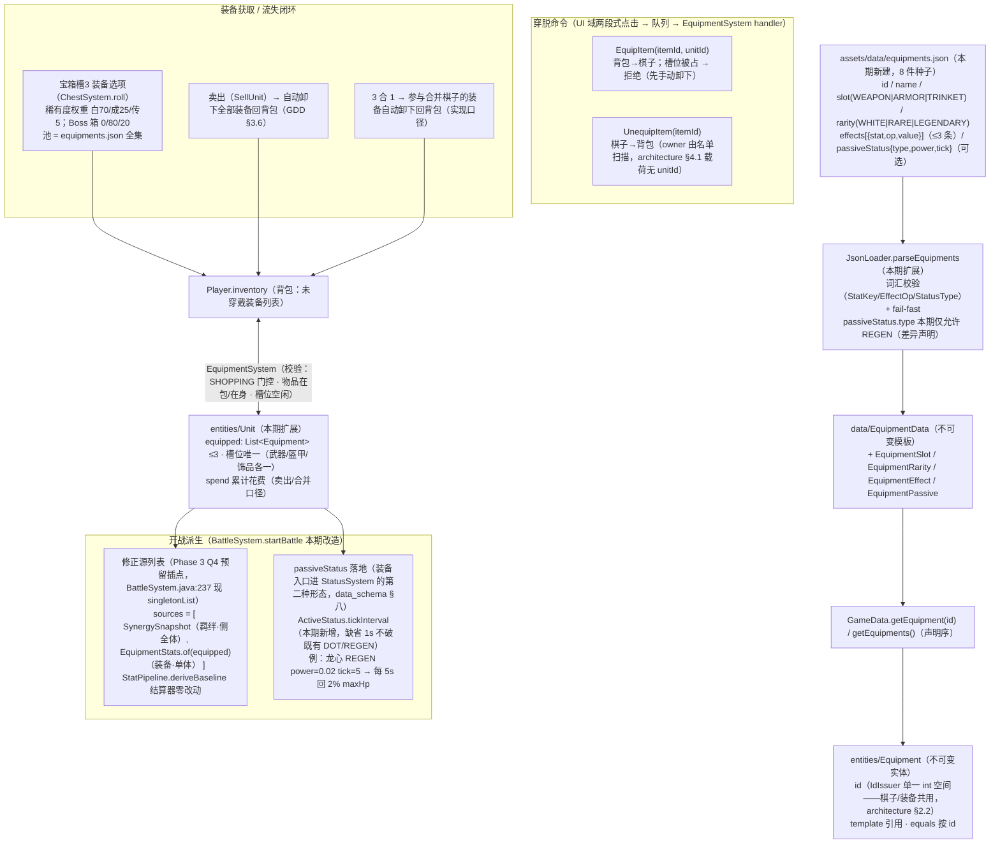

# Phase 5 装备实体与命令链路图

> Q1 裁决 A 全链：equipments.json → EquipmentData → Equipment 实体（第二类实体、单一 id 空间）→ 穿脱命令 → 开战派生（装备修正源 + passiveStatus）→ 宝箱/卖出闭环。
> 浏览器查看版：`phase5_equipment_chain.html`（双击打开）
> 依据：`gdd_idea_0.0.0.1.md` §5.2（B2 灵活可拆卸）/§3.6（卖出自动卸下）；`data_schema_design.md` §八（结构锁定）；`architecture_design.md` §4.1（命令载荷）；Phase 3 Q4 裁决（修正源列表化——装备源即插）

## 关键裁决与口径

| 项 | 决定 | 出处 |
|----|------|------|
| 装备是背包物品，随时 A↔B 转移；每棋子 3 槽（武器+盔甲+饰品） | GDD §5.2 B2 | 已实现为 slot 唯一性校验 |
| MVP 无合成；CombineEquipment 留大版本扩展 | GDD §5.2 | 本期不做 |
| 装备不与技能联动 | GDD §6.5 | 修正只走 stat 通道 + passiveStatus |
| 槽位被占时 EquipItem | 拒绝（UI 提示先卸下）——实现口径 | GDD 未定，B2 哲学下取最简确定语义 |
| 卖出自动卸下回背包，不随棋子消失 | GDD §3.6 | SellUnit handler 内 EquipmentSystem.unequipAll |
| 战歌号角"全体友军能量获取+15%" | 本期实现为穿戴者自身 energyGainRate +15%（schema 无 target 字段，光环装备待 schema 扩展） | 差异声明，记 §8 |
| passiveStatus.type | 本期仅 REGEN（加载期 fail-fast），其余类型待扩展 | 实现口径 |
| 背包无上限；InventoryPanel（③ 区 3×2）显示前 6 件 + 总数角标 | 实现口径（GDD/render 未定上限） | 记 §8 WARNING |
