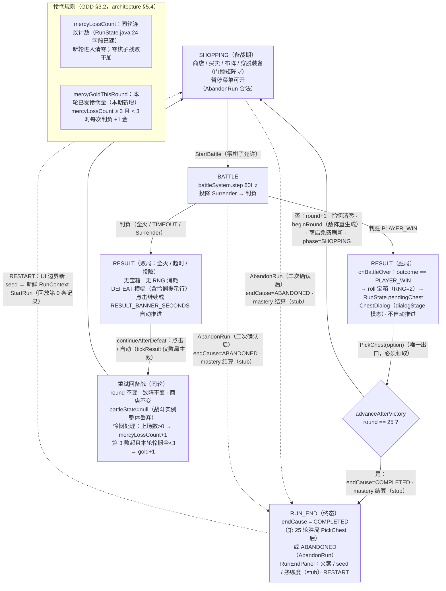

# Phase 5 RESULT 期与 PickChest / 判负重试状态流转图

> 1C-R 战败处理（GDD §2.2）本期完整落地：胜 → 宝箱三选一 → 下一轮；负 → 同轮重试 + 怜悯；AbandonRun → RUN_END。
> 浏览器查看版：`phase5_result_retry_flow.html`（双击打开）
> 依据：`gdd_idea_0.0.0.1.md` §2.2/§3.2；`architecture_design.md` §5.1（状态图）/§5.4（判负路径）；Phase 4 差异声明 #6（判负同轮重试推 Phase 5）本期销账

## 与 Phase 4 行为的差异（销账 Phase 4 差异声明 #6）

| 项 | Phase 4 | Phase 5 |
|----|---------|---------|
| 判负流转 | 与胜局相同：round+1 推进 | 同轮重试：round/敌阵/商店全不变，怜悯计数+1 |
| RESULT 出口 | 横幅点击或 3s 自动统一 round+1 | 胜局必须 PickChest（无自动推进）；败局保留自动推进 |
| 第 25 轮战毕 | 直接 RUN_END | 胜局仍先 PickChest（architecture §4.4：回放流终点 = 最终 Boss 轮的 PickChest）再 RUN_END |
| RUN_END 成因 | 无区分 | endCause：COMPLETED / ABANDONED（RunEndPanel 文案区分） |
| 重开 seed | 同 DEMO_SEED=42（RunFlowSystem.java:31） | UI 域边界新 seed（Q3 裁决 B 配套），DEMO_SEED 常量删除 |

## 门控矩阵增量（architecture §5.2 对照）

| 命令 | SHOPPING | BATTLE | RESULT | 备注 |
|------|:---:|:---:|:---:|------|
| PickChest | | | ✓ | 待 pendingChest != null 且未领取 |
| AbandonRun | ✓ | ✓ | | RESULT 期不合法（败局走继续、胜局必须领箱） |
| StartRun | 仅新鲜上下文（round==1 且未 started） | | | 回放第 0 条记录；seed/sceneId 与上下文一致性校验 |
