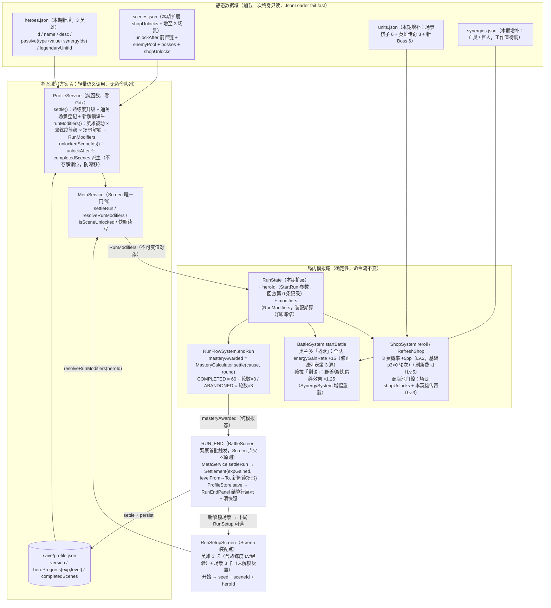

# Phase 6 局外成长数据流图（档案域 ↔ 局内模拟域）

> Phase 6 = GDD §十二路线图第 6 阶段：英雄熟练度、场景解锁、存档系统。
> 浏览器查看版：`phase6_meta_dataflow.html`（双击打开）
> 依据：`gdd_idea_0.0.0.1.md` §八（局外成长）/§7.4（场景差异化）；`architecture_design.md` §一（三态域）/§三（档案层方案 A）/§八（持久化双轨）

## 关键边界（architecture §一 三态域）

| 边界事件 | 归宿 | 说明 |
|----|------|------|
| RunSetup「开始远征」 | 域边界事件 | UI 态结算为 `StartRun(seed, sceneId, heroId)` 参数（heroId 扩展位本期启用） |
| RUN_END 首帧观察 | 档案语义调用 | BattleScreen 调 `MetaService.settleRun`；模拟域（RunFlowSystem）不触碰档案 IO，回放性保持 |
| 进入 SHOPPING / pause / hide | 快照轨写入 | 存档点仅备战阶段（决策 2026-08-20）；RUN_END 删档 |
| 商店 reroll / 开战派生 | 确定性系统反应 | RunModifiers 在装配期冻结进 RunState，同 seed + 同 heroId + 同命令流 → 同结果 |

## 熟练度等级解锁表（GDD §8.1 + 本期工作值）

| 等级 | 解锁内容 | 代码承载 |
|------|----------|----------|
| Lv.1 | 初始金币 +2（全英雄基础权益） | `RunModifiers.startGoldBonus` |
| Lv.2 | 商店 3 费概率 +5pp（仅该英雄） | `RunModifiers.rareShopBonusPp`（ShopSystem 权重调整，RNG 消耗不变） |
| Lv.3 | 解锁该英雄专属传奇棋子（进商店池） | `RunModifiers.legendaryUnitId`（池门控） |
| Lv.4 | 开局金币额外 +3（**工作值待调**，GDD「更多待设计」） | `RunModifiers.startGoldBonus` 叠加 |
| Lv.5 | 商店刷新费 -1，最低实付 1 金（**工作值待调**） | `RunModifiers.refreshCostDiscount` |
