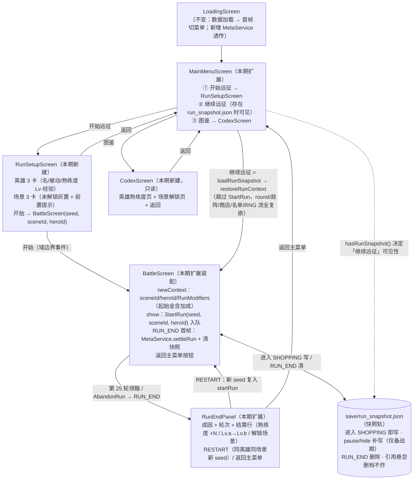

# Phase 6 Screen 导航与存档触发流转图

> Phase 5 遗留 Q3/Q5 销账：RunSetupScreen / CodexScreen / 终局结算 / 挂起快照（RunResultScreen 独立演出屏推 Phase 7，见 spec §4 裁决 D6）。
> 浏览器查看版：`phase6_screen_flow.html`（双击打开）
> 依据：`architecture_design.md` §七（6 Screen）/§八（持久化双轨）；`gdd_idea_0.0.0.1.md` §2.1

## 快照轨触发点（存档点仅备战阶段，决策 2026-08-20 沿用）

| 触发 | 时机 | 条件 | 动作 |
|------|------|------|------|
| 轮次快照 | BattleScreen 观察到 phase 进入 SHOPPING（新轮/重试回备战/开局） | `runStarted == true` | `MetaService.saveRunSnapshot` |
| 挂起快照 | `pause()` / `hide()`（Android 挂起、切窗、退出） | `phase == SHOPPING && runStarted` | 同上 |
| 删档 | RUN_END 首帧（结算同拍） | — | `MetaService.clearRunSnapshot` |
| 读档 | 主菜单「继续远征」 | 快照存在且引用完整 | `restore`：Player/RunState/商店槽/敌阵/装备背包/**RNG 消耗计数**（burn 恢复）全复原 |

## 恢复保真清单（SnapshotCodec.restore）

- seed / sceneId / heroId / round / 怜悯双计数 / runStarted
- RNG：`new RandomGenerator(seed, consumedCount)` 重放 nextFloat 对齐底层流（全消耗点均为单次 nextFloat，architecture §六）
- id 发号器：`SequentialIdIssuer(next)` 续号（单一 id 空间不断档）
- 名单：备战席入席序 + 部署表 18 格（单位 id/模板/星级/spend/已穿装备）
- 背包：装备 id/模板；商店 5 槽模板（含空槽）；敌阵 WaveSpec（模板/星级/强度/坐标——保「轮内敌阵不变」不变量）
- 不持久化：logicTick（命令历史不保，恢复后清空）、notices（瞬态）
