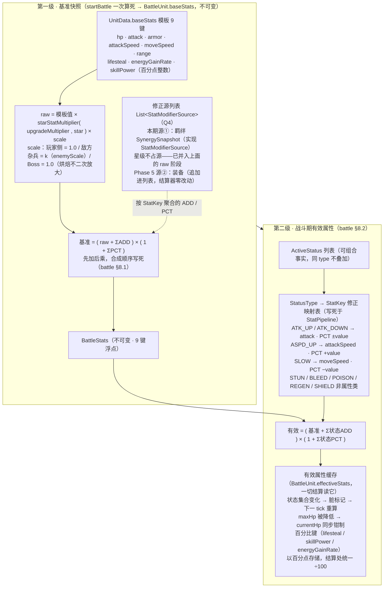

# 属性派生管线图（Phase 3，两级）

> `UnitData.baseStats` → 第一级基准快照（开战一次算死）→ 第二级战斗期有效属性（状态变化时脏标记重算）。
> 浏览器查看版：`stat_pipeline.html`（双击打开）
> 依据：`battle_design.md` §八（8.1 基准 / 8.2 战斗期修正 / 8.3 全局常量）；Q4 裁决"修正源列表"（Phase 5 装备源零改插入）

## 消费点

| 结算处 | 读取 |
|--------|------|
| 普攻出手 / 技能施放的攻击力基数 | 有效 attack（发射时冻结快照） |
| 命中时护甲公式 `100/(100+armor)` | 目标命中时有效 armor |
| 攻击间隔 = 1/attackSpeed、跳格冷却 = 1/moveSpeed | 有效值（攻速/移速类状态即时生效） |
| 技能幅度 ×(1+skillPower/100)、回能 ×energyGainRate/100、吸血 ×lifesteal/100 | 有效值（百分点 ÷100） |
