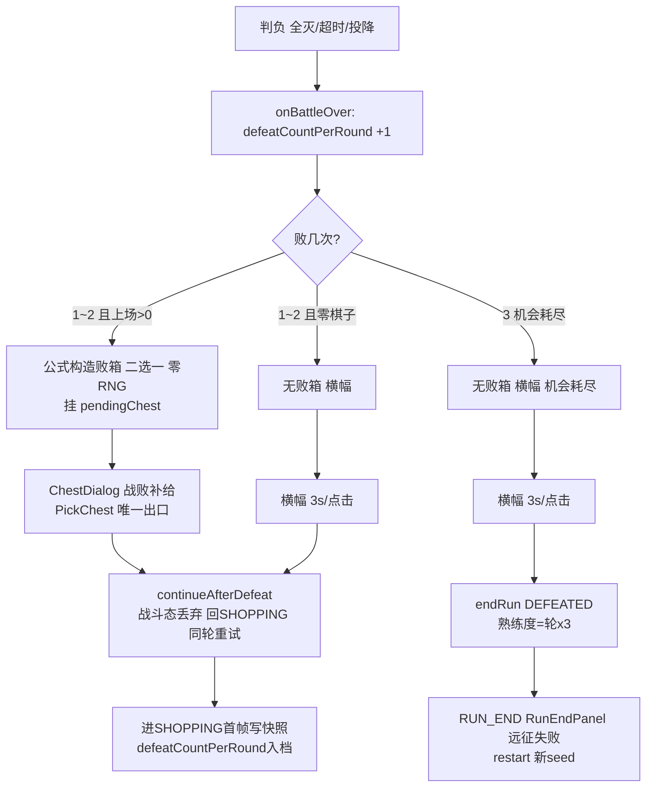

# 判负三分岔 · 败箱与每轮 3 次机会制 + 经济增强包 技术实施文档

> 状态：**已裁决定稿**（2026-08-24 用户裁决 E1~E4 全部采纳推荐方案，见 §9 各条「✅ 裁决」）
> 日期：2026-08-24 ｜ 分支：feature/enhance_01（HEAD 8d933b2） ｜ 产出：libgdx-impl-planner
> 依据：GDD V0.15 §2.2/§3.2/§3.5/§8.1、architecture V1.9 §5.4/§六/§八、render V1.4 §九、data_schema V1.6 §十、input V1.6 §4.3

---

## 1. 背景与目标

GDD V0.15（commit 8d933b2）把 V0.14 的"败局补给箱 + 无限重试"升级为**每轮 3 次机会制**，并整体删除怜悯机制；同批并入**经济增强包**（宝箱金币封顶 12 / 经验书曲线化 / 棋手经验表压平）。本 spec 将两修订转为可落地改动点。

**成功标准**：

1. 判负瞬间 `RunState.defeatCountPerRound` +1（零棋子败照扣）；胜利推进新轮清零。
2. 判负三分岔：败 1~2 且上场 > 0 → 公式构造败箱（二选一）挂 `pendingChest`，`PickChest` 唯一出口，领取后回 SHOPPING 同轮重试（敌阵/轮次/商店不变）；败 1~2 且零棋子 → 无败箱横幅 3s/点击回 SHOPPING；败 3 → `endRun(DEFEATED)` 进 RUN_END（新 seed 重开复用 restart 流程）。
3. 怜悯机制 7 处锚点全删（常量 / applyMercy / RunState 两字段 / 快照两键 / 横幅怜悯行 / BattleScreen.mercyLine）。
4. 败箱零 RNG 消耗（RNG 消耗点清单仍 4 处，architecture §六）。
5. 旧档（含已删怜悯键）→ 读取抛错 → 按 D20 坏档删档重置，不迁移。
6. 失败结算熟练度 = 轮 ×3（`DEFEATED` 显式分支，与 ABANDONED 同口径）。
7. 经济数值：`CHEST_GOLD_CAP` 10→12（25 轮全胜宝箱总收入 = **199 金**，GDD §3.2 验收账）；经验书 +4 固定 → `4 + floor(轮/5)`（Boss 不加倍）；棋手经验表 4/8/16/24/40/56 → **4/8/12/20/28/36**（满级总需求 148→108）。全部工作值待调。

## 2. 术语与约定

| GDD / 设计文档用语 | 代码标识符 | 备注 |
|---|---|---|
| 每轮 3 次机会制 / 机会计数 | `RunState.defeatCountPerRound` + `GameBalance.DEFEAT_LIMIT_PER_ROUND` | 判负瞬间 +1；新轮清零 |
| 第 3 败终局 / 远征失败 | `RunEndCause.DEFEATED` → `endRun(ctx, DEFEATED)` | 新增枚举值 |
| 败箱 / 战败补给箱 | `ChestOffer(origin=DEFEAT)`，`ChestSystem.buildDefeatOffer(round)` | 二选一：金币/经验书，无装备槽 |
| 胜箱 | `ChestOffer(origin=VICTORY)`，`ChestSystem.roll(...)` | 现存三选一 |
| 败箱金币 = 胜箱 ×50% 向下取整 | `GameBalance.defeatChestGold(round)` = `chestGold(round, boss) / 2` | Boss 按加倍后值减半（§3.2 锚点：7 轮 5 / 15 轮 8 / 25 轮 11） |
| 经验书 4 + floor(轮/5) | `GameBalance.chestExpBook(round)` | 胜箱败箱同公式同值；Boss 不加倍 |
| 怜悯机制（已删） | `MERCY_START_LOSS` / `MERCY_CAP_PER_ROUND` / `applyMercy` / `mercyLossCount` / `mercyGoldThisRound` | 全删 |
| 剩余机会行 | `BattleScreen.resultStatusLine()`（静态可测） | 败 1~2「剩余机会 N」；败 3「机会耗尽 · 远征失败」 |
| 坏档删档重置 | 裁决 D20（Phase 6）：读取抛 `DataValidationException` → Store 删档 | 本 spec E1 沿用 |

## 3. 现状盘点（2026-08-24 实读）

### 3.1 可直接复用
- `RunFlowSystem.tickResult` 自动推进骨架（RunFlowSystem.java:156-165）——`pendingChest` 守卫与 3s 计时天然适配败箱期（有败箱则不自动推进，与胜局同律）。
- `ResultBanner.ClickCatcher`（ResultBanner.java:26-32）点击继续 → `flow.continueAfterDefeat`——败 3 终局路由放入 flow 内分岔后，UI 调用零改动。
- `BattleScreen.syncChestDialog`（BattleScreen.java:371-380）：按 `pendingChest != null && phase == RESULT` push/pop `ChestDialog`——败箱复用同通路（render §九"共用 ChestDialog + PickChest 通路"）。
- 快照触发（BattleScreen.java:320-325）：进 SHOPPING 首帧写——领败箱回 SHOPPING 后自然触发，符合 GDD"领箱回 SHOPPING 后才写快照"；RESULT 期关窗未领败箱作废重打（恢复回本轮备战快照，D10 口径不变）。
- `ChestOption` 工厂（ChestOption.java:21-22）：`gold(amount)` / `expBook(amount)`——败箱两选项直接复用。
- `ProfileService.settle`（ProfileService.java:83）：`cause == COMPLETED` 才登记通关场景——`DEFEATED` 天然不解锁，**无需改动**（登记防误改）。
- restart 流程（RunEndPanel onRestart → BattleScreen.restartRun 新 seed 新上下文 → RunFlowSystem.restart）——败 3 重开零改动复用。

### 3.2 需改造（= §6 改动点）
- `RunEndCause`（2 值枚举）、`GameBalance`（怜悯 2 常量 + 3 处经济数值 + chestGold 封顶）、`ChestOffer`（恰 3 选项校验 + 无胜败语义）、`ChestSystem`（经验书固定 4 + 无败箱构造）、`RunState`（怜悯 2 字段 ↔ 机会计数 1 字段）、`RunFlowSystem`（onBattleOver/tickResult/continueAfterDefeat/PickChest/advanceAfterVictory/applyMercy 六处）、`MasteryCalculator`（DEFEATED 显式分支）、`RunSnapshot` + `SnapshotCodec`（怜悯 2 键 → 机会计数 1 键 + 版本升级）、`ResultBanner`（mercyLine 参数）、`BattleScreen`（mercyLine()）、`ChestDialog`（硬 3 按钮 + 标题二值）、`RunEndPanel`（成因文案二值）。
- 测试改写：`RunFlowSystemTest`（怜悯用例删、三分岔新增）、`RunStateTest`、`GameBalanceTest`、`SnapshotCodecTest`、`MetaServiceTest`（见 §6 各 CP 测试要点）。

### 3.3 需新建
- `ChestOrigin` 枚举（VICTORY / DEFEAT）——败箱语义载体（PickChest 分岔 + 弹窗标题）。
- 图表 `docs/diagrams/defeat_chance_flow.md` + `.html`（判负三分岔流程）。
- 文档回写：README:16、`docs/diagrams/interaction_flow.md` 判负边、`docs/diagrams/phase5_result_retry_flow.md` 顶部注记、`docs/game_lore_design.md` §二引用（待裁决 E4）。

## 4. 已确认决策（用户/既有裁决沿用）

| # | 问题 | 裁决 | 来源 |
|---|---|---|---|
| D-a | 零棋子战败 | 不给败箱、照常消耗机会（防刷：机会按战败次数计，与上场人数无关） | GDD §2.2 2026-08-23 用户裁决 |
| D-b | 投降 | 与普通战败同口径（计机会 / 给箱条件同上场 > 0 / 第 3 次即终局）——现有 `SurrenderCommand → finish(ENEMY_WIN)`（RunFlowSystem.java:82-88）天然走判负路径，零额外改动 | GDD §2.2 |
| D-c | 怜悯机制 | 整体删除（3 次机会制下"第 3 败起怜悯"永触发不了）；删除清单见 architecture §5.4 | GDD 决策日志 2026-08-23 |
| D-d | 败箱"每轮 ≤2" | 不设独立常量，由机会制推导（第 3 败无箱直接终局） | architecture §5.4 |
| D-e | 败箱 RNG | 公式构造零 RNG，§六消耗点清单仅补注不增项 | GDD §2.2 / architecture §六 |
| D-f | 快照口径 | 领箱回 SHOPPING 后才写快照（D10"进 SHOPPING 即写"不变）；RESULT 期关窗未领败箱作废重打；`defeatCountPerRound` 入快照（续玩不重置） | GDD §2.2 / D10 |
| D-g | DEFEATED 熟练度 | = 轮 ×3（与 ABANDONED 同口径）；`ProfileService.settle` 不解锁场景 | GDD §8.1 |
| D-h | 败 3 重开 | 复用现有 restart 流程：同英雄同场景新 seed | GDD §2.2 / architecture §5.4 |
| D-i | 敌方曲线 | 本批一律不动（修订二只动玩家侧） | GDD §7.3 |
| D-j | 经济数值 | 封顶 12 / 经验书 4+floor(轮/5) / 经验表 4/8/12/20/28/36，全部工作值待调，Phase 7 复调 | GDD §3.2/§3.5 |
| D10/D20 | 快照触发 / 坏档 | 进 SHOPPING 即写；读取抛错 → 删档重置不迁移 | Phase 6 裁决（auto_adjudications §2） |

## 5. 总体技术方案

数据流：`BattleScreen` 逻辑 tick 观察 `battleState.isOver` → `RunFlowSystem.onBattleOver`（判负瞬间机会 +1 并按三分岔决定是否构造败箱）→ RESULT 期（有败箱 = PickChest 唯一出口；无箱 = 横幅 3s/点击 → `continueAfterDefeat` 内部再分岔：机会未尽回 SHOPPING / 耗尽 `endRun(DEFEATED)`）。终局路由收敛在 flow 层单点（`continueAfterDefeat`），横幅点击与自动推进共用入口，UI 零路由逻辑。

流程图：`docs/diagrams/defeat_chance_flow.md`（+ `.html`）



## 6. 改动点清单（评审主入口）

> 「修改前」代码逐字摘自 HEAD 8d933b2。同段代码完整改动只出现在一个 CP，其余引用。

### CP1. `RunEndCause` 新增枚举值 `DEFEATED`
- **类型**：修改类（枚举加值）
- **位置**：`core/src/main/java/com/voidvvv/kz_auto_chess_n/entities/RunEndCause.java:3-9`（全文件）
- **改动说明**：第 3 败终局成因。`RunEndPanel` 文案（CP13）、`MasteryCalculator`（CP7）、`ProfileService.settle`（`cause == COMPLETED` 判定不受影响）消费。
- **代码**：
```java
// 修改前
/** RUN_END 成因（RunEndPanel 文案区分；GDD §2.1 胜利条件 / 放弃远征） */
public enum RunEndCause {
    /** 击败第 25 轮最终 Boss（通关） */
    COMPLETED,
    /** 暂停菜单放弃远征（AbandonRun） */
    ABANDONED
}
```
```java
// 修改后
/** RUN_END 成因（RunEndPanel 文案区分；GDD §2.1 胜利条件 / 放弃远征 / §2.2 第 3 败终局） */
public enum RunEndCause {
    /** 击败第 25 轮最终 Boss（通关） */
    COMPLETED,
    /** 暂停菜单放弃远征（AbandonRun） */
    ABANDONED,
    /** 本轮第 3 次战败（机会耗尽，GDD §2.2 3 次机会制；熟练度同 ABANDONED = 轮×3） */
    DEFEATED
}
```
- **测试要点**：`RunEndCauseTest`（或并入 CP7 测试）：枚举三值存在性编译期即验；无需独立行为断言。

### CP2. `GameBalance` 经济常量与公式改造（修订一 + 修订二数值全量）
- **类型**：修改类（删 2 常量、增 1 常量、改 1 常量、改 1 数组、增 2 公式方法）
- **位置**：`core/src/main/java/com/voidvvv/kz_auto_chess_n/config/GameBalance.java:54-56`（经济段）、`:78`（经验书）、`:101-102`（经验表）、`:147-152`（chestGold）
- **改动说明**：
  1. 删 `MERCY_START_LOSS` / `MERCY_CAP_PER_ROUND`（怜悯删除，architecture §5.4 删除清单第 1 条）；
  2. 增 `DEFEAT_LIMIT_PER_ROUND = 3`（每轮战败机会上限，工作值待调；败箱"每轮 ≤2"由本常量推导——第 3 败无箱终局）；
  3. `CHEST_GOLD_CAP` 10 → 12（修订二；现公式最大基础值 11，封顶 12 ≈ 解除封顶，GDD §3.2 注）；
  4. `EXP_TO_NEXT_LEVEL` → {4, 8, 12, 20, 28, 36}（满级总需求 148→108）；
  5. `CHEST_EXP_BOOK_GAIN` 固定值改为公式 `chestExpBook(round)` = `4 + round / 5`（锚点：1 轮 4 / 5 轮 5 / 10 轮 6 / 15 轮 7 / 20 轮 8 / 25 轮 9；Boss 不加倍）；旧常量保留为基底 `CHEST_EXP_BOOK_BASE = 4`（防魔法数字，调用方改用公式）；
  6. 增 `defeatChestGold(round)` = `chestGold(round, isBossRound(round)) / 2`（败箱金币 = 加倍后胜箱值 ×50% 向下取整；GDD §3.2 锚点：第 7 轮 5 / 第 15 轮 8 / 第 25 轮 11）。
- **代码**（四处对照，同一文件）：

```java
// 修改前（:54-56）
    public static final int CHEST_GOLD_CAP = 10;
    public static final int MERCY_START_LOSS = 3;
    public static final int MERCY_CAP_PER_ROUND = 3;
```
```java
// 修改后
    public static final int CHEST_GOLD_CAP = 12; // 修订二：10→12（现公式最大基础值 11，≈解除封顶；待调）
    /** 每轮战败机会上限（3 次机会制，GDD §2.2；第 3 败直接终局无败箱；工作值待调） */
    public static final int DEFEAT_LIMIT_PER_ROUND = 3;
```

```java
// 修改前（:77-78）
    /** 槽2 经验书固定经验值（对齐"4 金 = 4 经验"购买价比，待调） */
    public static final int CHEST_EXP_BOOK_GAIN = 4;
```
```java
// 修改后
    /** 槽2 经验书基底（修订二：4 + floor(轮/5)——GDD §3.2；Boss 不加倍；待调） */
    public static final int CHEST_EXP_BOOK_BASE = 4;
```

```java
// 修改前（:101-102）
    /** 棋手等级 → 升到下一级所需经验（GDD §3.5：Lv.1→2 起 4/8/16/24/40/56；Lv.7 封顶为 0） */
    private static final int[] EXP_TO_NEXT_LEVEL = {4, 8, 16, 24, 40, 56, 0};
```
```java
// 修改后
    /** 棋手等级 → 升到下一级所需经验（修订二压平：4/8/12/20/28/36，总需求 148→108；Lv.7 封顶为 0；待调） */
    private static final int[] EXP_TO_NEXT_LEVEL = {4, 8, 12, 20, 28, 36, 0};
```

```java
// 修改前（:147-152）
    /** 宝箱金币：3 + floor(轮/3)，第21轮起封顶10；Boss 箱 ×2（GDD §3.2） */
    public static int chestGold(int round, boolean boss) {
        checkRound(round);
        int base = Math.min(CHEST_GOLD_CAP, 3 + round / 3);
        return boss ? base * 2 : base;
    }
```
```java
// 修改后
    /** 宝箱金币：3 + floor(轮/3)，封顶 12（修订二）；Boss 箱 ×2（GDD §3.2） */
    public static int chestGold(int round, boolean boss) {
        checkRound(round);
        int base = Math.min(CHEST_GOLD_CAP, 3 + round / 3);
        return boss ? base * 2 : base;
    }

    /** 经验书：4 + floor(轮/5)，胜箱败箱同公式同值，Boss 不加倍（修订二，GDD §3.2；待调） */
    public static int chestExpBook(int round) {
        checkRound(round);
        return CHEST_EXP_BOOK_BASE + round / 5;
    }

    /** 败箱金币 = 加倍后胜箱金币 ×50% 向下取整（GDD §3.2 锚点：7 轮 5 / 15 轮 8 / 25 轮 11；待调） */
    public static int defeatChestGold(int round) {
        checkRound(round);
        return chestGold(round, isBossRound(round)) / 2;
    }
```
- **测试要点**（`GameBalanceTest`，先红后绿）：
  - 删除：`MERCY_*` 引用用例（编译错即红）。
  - `chestGold`：第 24 轮 = 11（旧封顶 10 下为 10——回归断言）、第 25 轮 Boss = 22；**25 轮全胜宝箱金币总收入 = 199**（`sum(chestGold(r, isBossRound(r)))`，GDD §3.2 验收账回归锚）。
  - `chestExpBook`：轮次 1/5/10/15/20/25 → 4/5/6/7/8/9。
  - `expToNextLevel`：Lv.1~6 依次 4/8/12/20/28/36，Lv.7 = 0；**求和 = 108**。
  - `defeatChestGold`：第 1 轮 1（胜箱 3 /2）、第 7 轮 5（Boss 10/2）、第 15 轮 8（16/2）、第 25 轮 11（22/2）。
  - `DEFEAT_LIMIT_PER_ROUND == 3`（工作值回归锚）。

### CP3. 新建 `ChestOrigin` 枚举 + `ChestOffer` 放宽 2~3 选项并携带胜败语义
- **类型**：新建文件 + 修改类
- **位置**：新建 `core/src/main/java/com/voidvvv/kz_auto_chess_n/entities/ChestOrigin.java`；修改 `ChestOffer.java:8-22`
- **改动说明**：败箱需 2 选项与「战败补给」标题、`PickChest` handler 需区分胜败分岔（CP6）。**推荐方案（待裁决 E2）**：`ChestOffer` 构造器校验放宽为 2~3，新增 `origin` 字段（`VICTORY`/`DEFEAT`），不新增败箱子类——理由：`optionAt` 越界返 null（ChestOffer.java:25-30）与 `ChestDialog` 按钮显隐（CP12）已可按选项数自适应；独立变体类会复制 `ChestOption` 聚合与 equals 逻辑。现有 3 参构造调用点（`ChestSystem.roll`、测试）保留 3 参便捷构造委托 canonical（默认 VICTORY），存量调用零改动。
- **代码**：

新建文件：
```java
package com.voidvvv.kz_auto_chess_n.entities;

/** 宝箱来源：胜局三选一（VICTORY，RNG roll）/ 败局 1~2 败补给二选一（DEFEAT，公式构造零 RNG——GDD §2.2） */
public enum ChestOrigin {
    VICTORY,
    DEFEAT
}
```

`ChestOffer` 修改：
```java
// 修改前（:8-22）
/** 宝箱三选一 offer（不可变；roll 于胜局进 RESULT 时一次性；领取后 RunState.pendingChest 置 null） */
public final class ChestOffer {
    private final int round;
    private final boolean boss;
    private final List<ChestOption> options;

    public ChestOffer(int round, boolean boss, List<ChestOption> options) {
        this.round = round;
        this.boss = boss;
        this.options = Collections.unmodifiableList(new ArrayList<ChestOption>(
                Objects.requireNonNull(options, "options 不能为 null")));
        if (options.size() != 3) {
            throw new IllegalArgumentException("宝箱必须恰有三个选项，实际=" + options.size());
        }
    }
```
```java
// 修改后
/** 宝箱 offer（不可变；胜局三选一 roll 于进 RESULT 时一次性，败局败箱二选一公式构造零 RNG——GDD §2.2；
 *  领取后 RunState.pendingChest 置 null） */
public final class ChestOffer {
    private final int round;
    private final boolean boss;
    private final ChestOrigin origin;
    private final List<ChestOption> options;

    /** 便捷构造（胜箱，存量调用点兼容） */
    public ChestOffer(int round, boolean boss, List<ChestOption> options) {
        this(round, boss, ChestOrigin.VICTORY, options);
    }

    /** canonical：胜箱 3 选项 / 败箱 2 选项（槽序 0=金币 1=经验书，无装备槽） */
    public ChestOffer(int round, boolean boss, ChestOrigin origin, List<ChestOption> options) {
        this.round = round;
        this.boss = boss;
        this.origin = Objects.requireNonNull(origin, "origin 不能为 null");
        this.options = Collections.unmodifiableList(new ArrayList<ChestOption>(
                Objects.requireNonNull(options, "options 不能为 null")));
        if (options.size() < 2 || options.size() > 3) {
            throw new IllegalArgumentException("宝箱选项必须为 2~3 个，实际=" + options.size());
        }
    }
```
getter 区补 `public ChestOrigin getOrigin() { return origin; }`；`equals`/`hashCode`（:36-51）补 `origin == that.origin` / `Objects.hash(round, boss, origin, options)`。

槽序注释（:24）同步：
```java
// 修改前
    /** 选项（槽序固定：0=金币 1=经验书 2=装备，实现口径 #1） */
// 修改后
    /** 选项（胜箱槽序：0=金币 1=经验书 2=装备，实现口径 #1；败箱槽序：0=金币 1=经验书，无装备槽） */
```
- **测试要点**（`ChestOfferTest`）：2 选项构造成功且 `getOrigin()==DEFEAT`；1 选项与 4 选项抛 `IllegalArgumentException`；3 参便捷构造默认 `VICTORY`；equals 含 origin 维度（胜败同 round/boss/options 不相等）。

### CP4. `ChestSystem`：胜箱经验书改公式 + 新增败箱构造
- **类型**：修改类
- **位置**：`core/src/main/java/com/voidvvv/kz_auto_chess_n/systems/ChestSystem.java:27-37`（roll）
- **改动说明**：胜箱槽 2 由固定 `CHEST_EXP_BOOK_GAIN` 改 `GameBalance.chestExpBook(round)`（修订二）；新增 `buildDefeatOffer(round)`——纯公式构造二选一（金币 = `defeatChestGold(round)` / 经验书 = `chestExpBook(round)`），**零 RNG**（architecture §六第 3 点补注）。`apply`（:40-54）对败箱选项（GOLD/EXP_BOOK）天然复用，仅通知行文案区分胜败（按 option kind 已足够，"宝箱：金币 +N"败箱语境可读，不强行分叉——工作值待调项）。
- **代码**：
```java
// 修改前（:27-37）
    /** 胜局进入 RESULT 时 roll 三选项（槽1 金币常驻 / 槽2 经验书 / 槽3 装备） */
    public ChestOffer roll(int round, GameData data, RandomGenerator rng) {
        boolean boss = GameBalance.isBossRound(round);
        int gold = GameBalance.chestGold(round, boss);
        ChestOption equipment = rollEquipment(data, rng,
                boss ? GameBalance.BOSS_CHEST_RARITY_WEIGHTS : GameBalance.CHEST_RARITY_WEIGHTS, gold);
        return new ChestOffer(round, boss, Arrays.asList(
                ChestOption.gold(gold),
                ChestOption.expBook(GameBalance.CHEST_EXP_BOOK_GAIN),
                equipment));
    }
```
```java
// 修改后
    /** 胜局进入 RESULT 时 roll 三选项（槽1 金币常驻 / 槽2 经验书 / 槽3 装备）；RNG 消耗 = 2（不变） */
    public ChestOffer roll(int round, GameData data, RandomGenerator rng) {
        boolean boss = GameBalance.isBossRound(round);
        int gold = GameBalance.chestGold(round, boss);
        ChestOption equipment = rollEquipment(data, rng,
                boss ? GameBalance.BOSS_CHEST_RARITY_WEIGHTS : GameBalance.CHEST_RARITY_WEIGHTS, gold);
        return new ChestOffer(round, boss, Arrays.asList(
                ChestOption.gold(gold),
                ChestOption.expBook(GameBalance.chestExpBook(round)),
                equipment));
    }

    /**
     * 败箱（败 1~2 且上场 > 0，GDD §2.2）：二选一，公式确定值——金币 = 胜箱 ×50% 向下取整
     * （Boss 按加倍后值减半）/ 经验书 = 胜箱同公式同值；无装备槽；零 RNG 消耗（architecture §六）。
     */
    public ChestOffer buildDefeatOffer(int round) {
        return new ChestOffer(round, GameBalance.isBossRound(round), ChestOrigin.DEFEAT, Arrays.asList(
                ChestOption.gold(GameBalance.defeatChestGold(round)),
                ChestOption.expBook(GameBalance.chestExpBook(round))));
    }
```
import 区补 `com.voidvvv.kz_auto_chess_n.entities.ChestOrigin`。
- **测试要点**（`ChestSystemTest`）：胜箱槽 2 断言 `expBook(4 + round/5)`（第 1/5/25 轮 4/5/9，Boss 轮同公式）；`buildDefeatOffer`：2 选项、origin=DEFEAT、第 7 轮 = [gold(5), expBook(5)]、第 15 轮 = [gold(8), expBook(7)]、第 25 轮 = [gold(11), expBook(9)]；**确定性**：同 round 重复调用产出相等（零 RNG，不接 RandomGenerator）。

### CP5. `RunState`：删怜悯两字段，增 `defeatCountPerRound`
- **类型**：修改类（字段替换）
- **位置**：`core/src/main/java/com/voidvvv/kz_auto_chess_n/entities/RunState.java:18`（类注释怜悯引文）、`:30`、`:38-39`、`:68`、`:73`、`:95-101`
- **改动说明**：机会计数归 `RunState`（architecture §2.3 所有权地图 2026-08-23 修订）。删 `mercyLossCount`/`mercyGoldThisRound` 字段 + getter/setter；增 `defeatCountPerRound`（int，本轮已战败次数）。**删除清单锚点**（architecture §5.4 删除段第 3 条）全落本 CP。
- **代码**：
```java
// 修改前（:18）
 * 商店/怜悯等经济态推 Phase 5（字段 {@code mercyLossCount} 先建好，触发逻辑后接）。
```
```java
// 修改后
 * 商店等经济态推 Phase 5；本轮战败机会计数 {@code defeatCountPerRound}（3 次机会制，GDD §2.2）。
```
```java
// 修改前（:30）
    private int mercyLossCount;
```
```java
// 修改后
    /** 本轮已战败次数（3 次机会制，GDD §2.2；判负瞬间 +1、新轮进入清零、入快照——D10 续玩不重置） */
    private int defeatCountPerRound;
```
```java
// 修改前（:38-39）
    /** RUN_END 期非 null */
    private RunEndCause endCause;
    /** 本轮已发怜悯金币（GDD §3.2 每轮 ≤3；新轮进入清零） */
    private int mercyGoldThisRound;
```
```java
// 修改后
    /** RUN_END 期非 null */
    private RunEndCause endCause;
```
```java
// 修改前（:68）
    public int getMercyLossCount() { return mercyLossCount; }
```
```java
// 修改后
    public int getDefeatCountPerRound() { return defeatCountPerRound; }
```
```java
// 修改前（:73）
    public int getMercyGoldThisRound() { return mercyGoldThisRound; }
```
（删除——`getDefeatCountPerRound` 已在 :68 位补入）
```java
// 修改前（:95-101）
    public void setMercyLossCount(int count) {
        this.mercyLossCount = count;
    }

    public void setMercyGoldThisRound(int count) {
        this.mercyGoldThisRound = count;
    }
```
```java
// 修改后
    public void setDefeatCountPerRound(int count) {
        if (count < 0 || count > GameBalance.DEFEAT_LIMIT_PER_ROUND) {
            throw new IllegalArgumentException(
                    "本轮战败次数必须在 0~" + GameBalance.DEFEAT_LIMIT_PER_ROUND + "，实际=" + count);
        }
        this.defeatCountPerRound = count;
    }
```
- **测试要点**（`RunStateTest`）：删怜悯 getter/setter 用例；`setDefeatCountPerRound` 接受 0~3、拒绝 -1 与 4（快照读侧防御由 CP9 校验，此处双保险）；默认 0。

### CP6. `RunFlowSystem` 判负三分岔 + 怜悯删除（本特性核心）
- **类型**：修改类（五个方法改造 + 一方法删除）
- **位置**：`RunFlowSystem.java:89-103`（PickChest handler）、`:143-153`（onBattleOver）、`:156-165`（tickResult）、`:167-180`（continueAfterDefeat）、`:186-202`（advanceAfterVictory）、`:219-232`（applyMercy 删）
- **改动说明**：
  1. **onBattleOver**：判负瞬间 `defeatCountPerRound + 1`（零棋子照扣，D-a）；败 1~2 且上场 > 0 → `buildDefeatOffer` 挂 `pendingChest`（零 RNG）；败 3 / 零棋子 → 无箱横幅。`playerSideCount`（:235-243）复用（含已清扫亡者的开战上场口径，#8）。
  2. **tickResult**：代码零改动——`continueAfterDefeat` 内部分岔后，3s 自动推进天然路由（机会未尽回 SHOPPING / 耗尽终局）。
  3. **continueAfterDefeat**：删 `applyMercy` 调用；终局路由单点收敛于此（横幅点击与自动推进共用，`ResultBanner` 调用零改动——与 architecture §5.4"其点击继续调用改路由终局"锚点的**实现口径偏差**：路由在 flow 不在 UI，理由：UI 已直调 `continueAfterDefeat`（ResultBanner.java:29），flow 内分岔消除双入口漂移风险，行为与锚点语义一致）。
  4. **PickChest handler**：按 `offer.getOrigin()` 分岔——胜局 `advanceAfterVictory`（原推进）/ 败局 `continueAfterDefeat`（机会已在判负时计过，此处不再计；战斗态丢弃在 `continueAfterDefeat` 内）。
  5. **advanceAfterVictory**：怜悯双清零 → `setDefeatCountPerRound(0)`（新轮进入清零，§5.1 关键区分）。
  6. **applyMercy 整删**（architecture §5.4 删除清单第 2 条）。
- **代码**：

```java
// 修改前（:143-153）
    public void onBattleOver(RunContext ctx) {
        if (ctx.getRunState().getPhase() != GamePhase.BATTLE) {
            return;
        }
        resultTimer = 0f;
        ctx.getRunState().setPhase(GamePhase.RESULT);
        if (ctx.getBattleState().getOutcome() == BattleOutcome.PLAYER_WIN) {
            ctx.getRunState().setPendingChest(chestSystem.roll(
                    ctx.getRunState().getRound(), ctx.getGameData(), ctx.getRng()));
        }
    }
```
```java
// 修改后
    public void onBattleOver(RunContext ctx) {
        if (ctx.getRunState().getPhase() != GamePhase.BATTLE) {
            return;
        }
        resultTimer = 0f;
        RunState runState = ctx.getRunState();
        runState.setPhase(GamePhase.RESULT);
        if (ctx.getBattleState().getOutcome() == BattleOutcome.PLAYER_WIN) {
            runState.setPendingChest(chestSystem.roll(
                    runState.getRound(), ctx.getGameData(), ctx.getRng()));
            return;
        }
        // 判负瞬间机会 +1（零棋子照扣——D-a 防刷口径；GDD §2.2）
        runState.setDefeatCountPerRound(runState.getDefeatCountPerRound() + 1);
        boolean chanceLeft = runState.getDefeatCountPerRound() < GameBalance.DEFEAT_LIMIT_PER_ROUND;
        boolean deployed = playerSideCount(ctx.getBattleState()) > 0;
        if (chanceLeft && deployed) {
            // 败 1~2 且上场 > 0：公式构造败箱（零 RNG），PickChest 唯一出口（GDD §2.2）
            runState.setPendingChest(chestSystem.buildDefeatOffer(runState.getRound()));
        }
        // 其余（零棋子败 / 第 3 败）：无败箱，横幅 3s/点击 → continueAfterDefeat 分岔
    }
```

```java
// 修改前（:167-180）
    /**
     * 败局继续（横幅点击或自动）：同轮重试（GDD §2.2 1C-R——round/敌阵/商店全不变）
     * + 怜悯（GDD §3.2：上场数>0 才计数，第 3 败起每轮 ≤3 金——口径 #8/#10）。
     */
    public void continueAfterDefeat(RunContext ctx) {
        RunState runState = ctx.getRunState();
        if (runState.getPhase() != GamePhase.RESULT || runState.getPendingChest() != null) {
            return;
        }
        int deployedCount = playerSideCount(ctx.getBattleState());
        ctx.setBattleState(null); // 战斗实例整体丢弃（双实体语义）
        applyMercy(ctx, deployedCount);
        runState.setPhase(GamePhase.SHOPPING);
    }
```
```java
// 修改后
    /**
     * 败局继续（横幅点击或自动）：机会未尽 → 同轮重试（round/敌阵/商店全不变，GDD §2.2）；
     * 机会耗尽（第 3 败）→ endRun(DEFEATED) 失败结算。终局路由单点（点击/自动共用入口）。
     */
    public void continueAfterDefeat(RunContext ctx) {
        RunState runState = ctx.getRunState();
        if (runState.getPhase() != GamePhase.RESULT || runState.getPendingChest() != null) {
            return; // 败箱未领不可推进（PickChest 唯一出口，与胜局同律——口径 #9）
        }
        ctx.setBattleState(null); // 战斗实例整体丢弃（双实体语义）
        if (runState.getDefeatCountPerRound() >= GameBalance.DEFEAT_LIMIT_PER_ROUND) {
            endRun(ctx, RunEndCause.DEFEATED); // 第 3 败终局（GDD §2.2；熟练度 = 轮×3）
            return;
        }
        runState.setPhase(GamePhase.SHOPPING);
    }
```

```java
// 修改前（:186-202，节选 :189-196）
    public void advanceAfterVictory(RunContext ctx) {
        RunState runState = ctx.getRunState();
        ctx.setBattleState(null);
        runState.setPendingChest(null);
        if (runState.getRound() >= GameBalance.TOTAL_ROUNDS) {
            endRun(ctx, RunEndCause.COMPLETED); // 第 25 轮领箱后通关（architecture §4.4 回放流终点）
            return;
        }
        runState.advanceRound();
        runState.setMercyLossCount(0); // 新轮重计（§5.1 关键区分：重试不清、新轮清）
        runState.setMercyGoldThisRound(0);
```
```java
// 修改后（同名方法，:194-196 三行清零替换为一行）
    public void advanceAfterVictory(RunContext ctx) {
        RunState runState = ctx.getRunState();
        ctx.setBattleState(null);
        runState.setPendingChest(null);
        if (runState.getRound() >= GameBalance.TOTAL_ROUNDS) {
            endRun(ctx, RunEndCause.COMPLETED); // 第 25 轮领箱后通关（architecture §4.4 回放流终点）
            return;
        }
        runState.advanceRound();
        runState.setDefeatCountPerRound(0); // 新轮机会清零（§5.1 关键区分：重试不清、新轮清）
```

PickChest handler（:89-103，仅 :99-101 分岔）：
```java
// 修改前（:99-102）
            runState.addNotice(chestSystem.apply(option, ctx.getPlayer(),
                    runState.getIdIssuer(), ctx.getGameData()));
            advanceAfterVictory(ctx); // 领取即推进（唯一出口，口径 #9）
            return true;
```
```java
// 修改后
            runState.addNotice(chestSystem.apply(option, ctx.getPlayer(),
                    runState.getIdIssuer(), ctx.getGameData()));
            if (offer.getOrigin() == ChestOrigin.DEFEAT) {
                continueAfterDefeat(ctx); // 败箱领取 → 同轮重试（机会已在判负时计过）
            } else {
                advanceAfterVictory(ctx); // 胜局领取即推进（唯一出口，口径 #9）
            }
            return true;
```
import 区补 `com.voidvvv.kz_auto_chess_n.entities.ChestOrigin`。

applyMercy 整删（:219-232，删除清单锚点）：
```java
// 修改前（:219-232）
    /** 怜悯：零棋子战败不计（GDD §3.2 防刷）；第 3 败起且本轮怜悯金 <3 → +1 金 */
    private void applyMercy(RunContext ctx, int deployedCount) {
        if (deployedCount == 0) {
            return;
        }
        RunState runState = ctx.getRunState();
        runState.setMercyLossCount(runState.getMercyLossCount() + 1);
        if (runState.getMercyLossCount() >= GameBalance.MERCY_START_LOSS
                && runState.getMercyGoldThisRound() < GameBalance.MERCY_CAP_PER_ROUND) {
            runState.setMercyGoldThisRound(runState.getMercyGoldThisRound() + 1);
            ctx.getPlayer().addGold(1);
            runState.addNotice("怜悯金币 +1（连败 " + runState.getMercyLossCount() + "）");
        }
    }
```
（整段删除；类 javadoc :26 中"怜悯"字样同步移除）
- **测试要点**（`RunFlowSystemTest`，先红后绿；**删**全部怜悯用例——连续 3 败 +1 金 / 零棋子不计连败等）：
  - 判负计数：上场 > 0 判负 → `defeatCountPerRound` 1→2→3；零棋子判负同样递增（D-a）。
  - 三分岔 × 战败 1：上场 > 0 → `pendingChest` origin=DEFEAT、2 选项；零棋子 → `pendingChest` null、phase 停 RESULT。
  - 败箱唯一出口：败箱期 `tickResult` 累计 > 3s 不推进（守卫）；`continueAfterDefeat` 直调 no-op；`PickChest(0)` → 金币入账（`defeatChestGold` 值）+ phase=SHOPPING + round/敌阵/商店不变 + battleState null。
  - 第 3 败：判负后 `pendingChest` null；3s 自动或点击 → phase=RUN_END、`endCause=DEFEATED`、`masteryAwarded = round×3`（CP7 联动）。
  - 投降同口径：BATTLE 期 `Surrender` → 走同一判负路径（机会 +1、按次数给箱）。
  - 胜利清零：败 2 次后胜局领箱推进 → 新轮 `defeatCountPerRound == 0`。
  - **RNG 确定性**：判负 + 败箱构造全程 `rng.getConsumedCount()` 不变（败箱零消耗回归锚）；同 seed 败局重放敌阵不变（重试不变量）。
  - 快照联动（回归）：领败箱回 SHOPPING 后捕获快照含 `defeatCountPerRound`（CP9 联动）。

### CP7. `MasteryCalculator` 显式 `DEFEATED` 分支
- **类型**：修改类
- **位置**：`MasteryCalculator.java:16-26`（GDD_BASIC lambda + javadoc）
- **改动说明**：现有 default 分支已天然返回 轮×3（:24），补显式分支 + javadoc 防未来改动破坏口径（architecture §5.4 明确"补显式分支/javadoc"）。
- **代码**：
```java
// 修改前（:16-26）
    /** GDD 基线口径（裁决 D3）：COMPLETED = 通关加成 + 轮数×3；ABANDONED = 轮数×3 */
    MasteryCalculator GDD_BASIC = new MasteryCalculator() {
        @Override
        public int settle(RunEndCause cause, int roundsReached) {
            if (cause == RunEndCause.COMPLETED) {
                return GameBalance.MASTERY_COMPLETE_BONUS
                        + roundsReached * GameBalance.MASTERY_EXP_PER_ROUND;
            }
            return roundsReached * GameBalance.MASTERY_EXP_PER_ROUND;
        }
    };
```
```java
// 修改后
    /** GDD 基线口径（裁决 D3）：COMPLETED = 通关加成 + 轮数×3；ABANDONED / DEFEATED = 轮数×3（同口径，GDD §8.1） */
    MasteryCalculator GDD_BASIC = new MasteryCalculator() {
        @Override
        public int settle(RunEndCause cause, int roundsReached) {
            if (cause == RunEndCause.COMPLETED) {
                return GameBalance.MASTERY_COMPLETE_BONUS
                        + roundsReached * GameBalance.MASTERY_EXP_PER_ROUND;
            }
            // ABANDONED（放弃远征）与 DEFEATED（第 3 败终局，GDD §2.2/§8.1）同口径 = 轮数×3
            return roundsReached * GameBalance.MASTERY_EXP_PER_ROUND;
        }
    };
```
- **测试要点**（`MasteryCalculatorTest`）：`settle(DEFEATED, 7) == 21`、`settle(DEFEATED, 25) == 75`；与 `settle(ABANDONED, n)` 恒等（同口径回归锚）。
- **登记（无改动）**：`ProfileService.settle`（ProfileService.java:83）`cause == COMPLETED` 才登记 `withCompletedScene`——`DEFEATED` 天然不解锁新场景，**禁止顺手改动**（architecture §5.4 登记防误改）。

### CP8. `RunSnapshot`：怜悯两字段 → `defeatCountPerRound`，版本 1→2
- **类型**：修改类
- **位置**：`RunSnapshot.java:9`（版本）、`:19-20`（字段）、`:41-47`（构造器签名）、`:54-55`（赋值）、`:75-76`（getter）
- **改动说明**：快照域替换。**版本升 2（待裁决 E1 推荐方案）**：旧档（v1，含怜悯键）在 `SnapshotCodec.read` 版本检查处即抛 → D20 删档重置，不做缺省 0 迁移——理由见 §9 E1。
- **代码**：
```java
// 修改前（:9）
    public static final int CURRENT_VERSION = 1;
```
```java
// 修改后（V2 = 3 次机会制：怜悯两键移除、defeatCountPerRound 入档；旧 v1 档按 D20 坏档重置不迁移）
    public static final int CURRENT_VERSION = 2;
```
```java
// 修改前（:18-20）
    private final int round;
    private final int mercyLossCount;
    private final int mercyGoldThisRound;
```
```java
// 修改后
    private final int round;
    /** 本轮已战败次数（3 次机会制——D10 续玩语义：恢复后已耗机会不重置） */
    private final int defeatCountPerRound;
```
构造器（:41-47）签名 `int mercyLossCount, int mercyGoldThisRound` → `int defeatCountPerRound`；赋值段（:54-55）对应替换；getter（:75-76）`getMercyLossCount()/getMercyGoldThisRound()` → `getDefeatCountPerRound()`（单 getter）。
- **测试要点**：编译期签名变更（调用点 SnapshotCodec + 测试同步）；见 CP9。

### CP9. `SnapshotCodec`：capture/write/read 键替换（旧档按 D20 重置）
- **类型**：修改类（三段）
- **位置**：`SnapshotCodec.java:105-110`（capture 构造）、`:204-205`（restore 赋值）、`:235-237`（write）、`:326-329`（键清单）、`:341-342`（read 解析）、`:395-398`（read 构造）
- **改动说明**：`mercyLossCount`/`mercyGoldThisRound` 两键 → `defeatCountPerRound` 一键（architecture §5.4 删除清单第 5 条 + 新增清单第 3 条）。旧档兼容：**不迁移**——v1 版本检查（:331-333，不变）即抛 `DataValidationException` → Store 按裁决 D20 删档重置（见 §9 E1：与"checkUnknownKeys 抛错"路径殊途同归，版本号拦截更早更明确）。
- **代码**：

capture（:105-108）：
```java
// 修改前
        return new RunSnapshot(RunSnapshot.CURRENT_VERSION, runState.getSeed(),
                ctx.getRng().getConsumedCount(), runState.getSceneId(), runState.getHeroId(),
                runState.getRound(), runState.getMercyLossCount(), runState.getMercyGoldThisRound(),
                runState.getIdIssuer().peekNext(), player.getGold(),
```
```java
// 修改后
        return new RunSnapshot(RunSnapshot.CURRENT_VERSION, runState.getSeed(),
                ctx.getRng().getConsumedCount(), runState.getSceneId(), runState.getHeroId(),
                runState.getRound(), runState.getDefeatCountPerRound(),
                runState.getIdIssuer().peekNext(), player.getGold(),
```

restore（:203-205）：
```java
// 修改前
        runState.setRound(s.getRound());
        runState.setMercyLossCount(s.getMercyLossCount());
        runState.setMercyGoldThisRound(s.getMercyGoldThisRound());
```
```java
// 修改后
        runState.setRound(s.getRound());
        runState.setDefeatCountPerRound(s.getDefeatCountPerRound());
```

write（:235-237）：
```java
// 修改前
        sb.append(",\"round\":").append(s.getRound());
        sb.append(",\"mercyLossCount\":").append(s.getMercyLossCount());
        sb.append(",\"mercyGoldThisRound\":").append(s.getMercyGoldThisRound());
```
```java
// 修改后
        sb.append(",\"round\":").append(s.getRound());
        sb.append(",\"defeatCountPerRound\":").append(s.getDefeatCountPerRound());
```

键清单（:326-329）：
```java
// 修改前
        checkUnknownKeys(root, "version", "seed", "rngConsumedCount", "sceneId", "heroId", "round",
                "mercyLossCount", "mercyGoldThisRound", "idIssuerNext", "playerGold", "playerLevel",
                "playerExp", "units", "benchUnitIndex", "deploymentUnitIndex", "inventory",
                "equipments", "shopSlotUnitIds", "enemyWave");
```
```java
// 修改后
        checkUnknownKeys(root, "version", "seed", "rngConsumedCount", "sceneId", "heroId", "round",
                "defeatCountPerRound", "idIssuerNext", "playerGold", "playerLevel",
                "playerExp", "units", "benchUnitIndex", "deploymentUnitIndex", "inventory",
                "equipments", "shopSlotUnitIds", "enemyWave");
```

read 解析（:341-342）：
```java
// 修改前
        int mercyLossCount = requireNonNegativeInt(root, "mercyLossCount");
        int mercyGoldThisRound = requireNonNegativeInt(root, "mercyGoldThisRound");
```
```java
// 修改后
        int defeatCountPerRound = requireNonNegativeInt(root, "defeatCountPerRound");
        if (defeatCountPerRound > GameBalance.DEFEAT_LIMIT_PER_ROUND) {
            throw new DataValidationException("run_snapshot.json/defeatCountPerRound: 不得超过 "
                    + GameBalance.DEFEAT_LIMIT_PER_ROUND + "，实际=" + defeatCountPerRound);
        }
```

read 构造（:395-398）：
```java
// 修改前
        return new RunSnapshot(version, seed, rngConsumedCount, requireString(root, "sceneId"),
                optionalString(root, "heroId"), round, mercyLossCount, mercyGoldThisRound,
                idIssuerNext, playerGold, playerLevel, playerExp, units, benchUnitIndex,
```
```java
// 修改后
        return new RunSnapshot(version, seed, rngConsumedCount, requireString(root, "sceneId"),
                optionalString(root, "heroId"), round, defeatCountPerRound,
                idIssuerNext, playerGold, playerLevel, playerExp, units, benchUnitIndex,
```
- **测试要点**（`SnapshotCodecTest` / `MetaServiceTest`）：
  - round-trip：败 2 次后领箱回 SHOPPING 捕获 → write/read → `defeatCountPerRound == 2` 复原；restore 后再判负 1 次 → 第 3 败终局（**D10 续玩语义：已耗机会不重置**——核心回归用例）。
  - **旧档坏档**：手工构造 v1 JSON（含 mercy 两键）→ read 抛 `DataValidationException`（版本拦截）；v2 JSON 含 `mercyLossCount` 键 → `checkUnknownKeys` 抛；`defeatCountPerRound` 缺失 → 抛；负值 / > 3 → 抛。
  - **续战等价**（沿 Phase 6 用例改造）：快照恢复局与连续局同命令流推演，终局状态一致（含机会计数）。

### CP10. `ResultBanner`：`mercyLine` 参数改为败局状态行
- **类型**：修改类
- **位置**：`ResultBanner.java:49-63`（refresh）；`:29` 点击调用**零改动**（路由收敛 flow，见 CP6.3 说明）
- **改动说明**：删怜悯行拼接（architecture §5.4 删除清单第 6 条）；参数更名 `mercyLine` → `statusLine`（败局附加行：败 1~2「剩余机会 N」/ 败 3「机会耗尽 · 远征失败」/ 败箱期「选择战败补给」，由 BattleScreen 组装——CP11）。败箱期（pendingChest 非空）横幅点击被 `continueAfterDefeat` 守卫拦住，天然不可跳过领箱（与胜局同律）。
- **代码**：
```java
// 修改前（:49-63）
    /** 每帧刷新文案（RESULT 期由 Screen 调用；mercyLine 可 null——败局怜悯提示；术语见计划 §2.1） */
    public void refresh(BattleOutcome outcome, String mercyLine) {
        if (outcome == BattleOutcome.PLAYER_WIN) {
            text = "胜利";
            tint = Color.GREEN;
            hint = "选择一个宝箱"; // 胜局唯一出口 = PickChest（口径 #9，无自动推进）
        } else if (outcome == BattleOutcome.ENEMY_WIN) {
            text = "战败";
            tint = Color.RED;
            hint = mercyLine != null ? "点击任意处重试 · " + mercyLine : "点击任意处重试";
        } else {
            text = "超时";
            tint = Color.YELLOW;
            hint = mercyLine != null ? "点击任意处重试 · " + mercyLine : "点击任意处重试";
        }
    }
```
```java
// 修改后
    /**
     * 每帧刷新文案（RESULT 期由 Screen 调用）。statusLine：败局附加行（Screen 组装，CP11）——
     * 败箱期「选择战败补给」/ 败 1~2 无箱「点击任意处重试 · 剩余机会 N」/ 败 3「机会耗尽 · 远征失败」；
     * null = 胜局（hint 内置）。
     */
    public void refresh(BattleOutcome outcome, String statusLine) {
        if (outcome == BattleOutcome.PLAYER_WIN) {
            text = "胜利";
            tint = Color.GREEN;
            hint = "选择一个宝箱"; // 胜局唯一出口 = PickChest（口径 #9，无自动推进）
        } else if (outcome == BattleOutcome.ENEMY_WIN) {
            text = "战败";
            tint = Color.RED;
            hint = statusLine != null ? statusLine : "点击任意处重试";
        } else {
            text = "超时";
            tint = Color.YELLOW;
            hint = statusLine != null ? statusLine : "点击任意处重试";
        }
    }
```
- **测试要点**：`refresh` 为 UI 直写（headless 无先例断言 tint/hint 字段私有无 getter）——文案组装逻辑全部下沉 `BattleScreen.resultStatusLine()` 静态函数（CP11）保证可测；本 CP 仅参数更名 + 删拼接，行为由 CP11 测试覆盖。`ResultBannerTest`（如存在 mercyLine 用例）同步删除。

### CP11. `BattleScreen.mercyLine()` 替换为 `resultStatusLine()`（静态可测）
- **类型**：修改方法（删 1 增 1）
- **位置**：`BattleScreen.java:346`（调用点）、`:363-368`（mercyLine 方法）
- **改动说明**：删怜悯行（architecture §5.4 删除清单第 7 条）；新函数按 RESULT 期状态组装败局行——工作值待调（GDD §十一）。静态纯函数（沿 `ShopBar.refreshPriceText` headless 先例，Phase 6 裁决 E11 口径）。
- **代码**：
```java
// 修改前（:363-368）
    /** 败局怜悯提示行（刚发的怜悯金 → 横幅行；否则 null） */
    private String mercyLine() {
        RunState runState = runContext.getRunState();
        return runState.getMercyGoldThisRound() > 0 && runState.getMercyLossCount() >= GameBalance.MERCY_START_LOSS
                ? "怜悯 +1（连败 " + runState.getMercyLossCount() + "）" : null;
    }
```
```java
// 修改后
    /**
     * RESULT 期横幅状态行（机会制，GDD §2.2；工作值待调）：
     * 胜局 null（hint 由 ResultBanner 内置）；败箱期「选择战败补给」；
     * 败 1~2 无箱「点击任意处重试 · 剩余机会 N」；败 3「机会耗尽 · 远征失败」。
     */
    static String resultStatusLine(RunState runState) {
        if (runState.getPendingChest() != null) {
            return runState.getPendingChest().getOrigin() == ChestOrigin.DEFEAT
                    ? "选择战败补给" : null; // 胜局 pendingChest → Banner 内置行
        }
        int left = GameBalance.DEFEAT_LIMIT_PER_ROUND - runState.getDefeatCountPerRound();
        if (left <= 0) {
            return "机会耗尽 · 远征失败"; // 第 3 败：点击/3s 后终局（CP6 路由）
        }
        return "点击任意处重试 · 剩余机会 " + left; // N = 2/1（工作值待调）
    }
```
调用点（:346）：
```java
// 修改前
            resultBanner.refresh(runContext.getBattleState().getOutcome(), mercyLine()); // 横幅读 outcome + 怜悯行（口径 #10）
// 修改后
            resultBanner.refresh(runContext.getBattleState().getOutcome(),
                    resultStatusLine(runContext.getRunState())); // 横幅读 outcome + 机会制状态行（GDD §2.2）
```
import 区补 `ChestOrigin`。
- **测试要点**（新增 `BattleScreenStatusLineTest`，headless 纯函数）：构造 RunState 各态断言——胜箱期 null；败箱期（pendingChest origin=DEFEAT）"选择战败补给"；败 1（count=1 无箱）"点击任意处重试 · 剩余机会 2"；败 2 → "…剩余机会 1"；败 3 → "机会耗尽 · 远征失败"。

### CP12. `ChestDialog`：2 选项支持 + 「战败补给」标题
- **类型**：修改类
- **位置**：`ChestDialog.java:45-47`（3 按钮构造）、`:90-128`（OptionButton，含 null 防御）、`:137`（标题）
- **改动说明**：render §九"共用 ChestDialog + PickChest 通路（标题区分「战败补给」，需支持 2 选项——现硬编码 3 按钮）"。按钮改按 `offer.getOptions().size()` 显隐 + 2 按钮居中重排；`draw` 加 option null 守卫（现 :111 `optionTint(data, option)` 对 null 会 NPE——3 按钮期败箱第 3 槽为空的防御）；标题三值。
- **代码**：

```java
// 修改前（:41-48）
    public ChestDialog(CommandManager commandManager, Assets assets, GameData data) {
        this.commandManager = commandManager;
        this.assets = assets;
        this.data = data;
        for (int i = 0; i < 3; i++) {
            addActor(new OptionButton(i));
        }
    }

    /** Screen 在 push 前刷新（offer 不可变，无逐帧刷新需求） */
    public void refresh(ChestOffer offer) {
        this.offer = offer;
    }
```
```java
// 修改后
    private final OptionButton[] buttons = new OptionButton[3];

    public ChestDialog(CommandManager commandManager, Assets assets, GameData data) {
        this.commandManager = commandManager;
        this.assets = assets;
        this.data = data;
        for (int i = 0; i < buttons.length; i++) {
            buttons[i] = new OptionButton(i);
            addActor(buttons[i]);
        }
    }

    /** Screen 在 push 前刷新（offer 不可变，无逐帧刷新需求）；按选项数显隐 + 居中重排（胜 3 / 败 2） */
    public void refresh(ChestOffer offer) {
        this.offer = offer;
        int n = offer.getOptions().size(); // 2~3（ChestOffer 构造校验）
        float totalW = n * 120f + (n - 1) * 10f;
        float x = (BoardGeometry.VIRTUAL_W - totalW) / 2f;
        for (int i = 0; i < buttons.length; i++) {
            buttons[i].setVisible(i < n);
            if (i < n) {
                buttons[i].setPosition(x + i * 130f, 130f);
            }
        }
    }
```
（import 补 `com.voidvvv.kz_auto_chess_n.render.board.BoardGeometry`；隐藏按钮不收点——`setVisible(false)` 的 Actor 不参与 hit，满足门控。）

OptionButton.draw null 守卫（:106-110）：
```java
// 修改前
        @Override
        public void draw(Batch batch, float parentAlpha) {
            if (offer == null) {
                return;
            }
            ChestOption option = offer.optionAt(index);
            Color tint = optionTint(data, option);
```
```java
// 修改后
        @Override
        public void draw(Batch batch, float parentAlpha) {
            if (offer == null) {
                return;
            }
            ChestOption option = offer.optionAt(index);
            if (option == null) {
                return; // 败箱 2 选项：第 3 槽无选项不绘制（防御；refresh 已隐藏）
            }
            Color tint = optionTint(data, option);
```

标题（:137）：
```java
// 修改前
        assets.font().draw(batch, offer != null && offer.isBoss() ? "BOSS 宝箱" : "宝箱", 268f, 216f);
```
```java
// 修改后
        assets.font().draw(batch, titleText(offer), 268f, 216f);
```
新增包级静态（headless 可测，沿 optionText 先例）：
```java
    /** 标题三值：败箱「战败补给」（GDD §2.2）/ Boss 箱 / 普通箱（工作值待调） */
    static String titleText(ChestOffer offer) {
        if (offer == null) {
            return "宝箱";
        }
        if (offer.getOrigin() == ChestOrigin.DEFEAT) {
            return "战败补给";
        }
        return offer.isBoss() ? "BOSS 宝箱" : "宝箱";
    }
```
（标题 x=268 按 4 字 1.5 倍字号估算——「战败补给」同为 4 字，x 不变。）
- **测试要点**（`ChestDialogTest`，headless 静态函数）：`titleText`：origin=DEFEAT → "战败补给"；VICTORY+boss → "BOSS 宝箱"；VICTORY → "宝箱"；null offer → "宝箱"。`optionText`/`optionTint` 既有用例不回归（金/经验选项文案沿旧值）。

### CP13. `RunEndPanel` 成因文案三值
- **类型**：修改方法
- **位置**：`RunEndPanel.java:76-78`
- **改动说明**：render §九"三分岔——远征通关 / 远征已放弃 / 远征失败（DEFEATED，新文案位）"。三值均 4 字，x=272 居中不变。
- **代码**：
```java
// 修改前（:76-78）
        boolean abandoned = ctx.getRunState().getEndCause() == RunEndCause.ABANDONED;
        assets.font().getData().setScale(2f);
        assets.font().draw(batch, abandoned ? "远征已放弃" : "远征通关", 272f, 268f); // 4 字 ×24px 居中
```
```java
// 修改后
        assets.font().getData().setScale(2f);
        assets.font().draw(batch, endTitleText(ctx.getRunState().getEndCause()), 272f, 268f); // 4 字 ×24px 居中
```
新增包级静态（headless 可测）：
```java
    /** 终局标题三值（render §九；工作值待调）：COMPLETED 远征通关 / ABANDONED 远征已放弃 / DEFEATED 远征失败 */
    static String endTitleText(RunEndCause cause) {
        switch (cause) {
            case ABANDONED:
                return "远征已放弃";
            case DEFEATED:
                return "远征失败";
            case COMPLETED:
            default:
                return "远征通关";
        }
    }
```
- **测试要点**（`RunEndPanelTextTest`，headless）：三成因 → 三文案；null cause 防御（endCause 为 null 时 default 通关——实际 RUN_END 期必非 null，防御分支）。

### CP14. 文档回写（README / 流程图 / 背景文档）—— 待裁决 E4
- **类型**：修改文档
- **位置**：
  - `README.md:16`：`- **失败原地重试**：战败不出局、不推进轮次，敌阵保持不变——侦察与针对性调整始终有价值`
  - `docs/diagrams/interaction_flow.md`（判负边 V0.2 表述）
  - `docs/diagrams/phase5_result_retry_flow.md`（顶部增机会制注记，历史图不改内文）
  - `docs/game_lore_design.md` §二（"失败原地重试"机制引用）
- **改动说明**：GDD 决策日志明示"随实施批次回写"。**推荐纳入本批次**（见 §9 E4）——四处均为低风险文案/注记改动，且首屏卖点（README:16）与实际规则不符是玩家可感矛盾。
- **代码**（README:16 对照；其余三处为文档段落，执行时按各文件现状措辞改写，语义如下）：
```markdown
<!-- 修改前（README.md:16） -->
- **失败原地重试**：战败不出局、不推进轮次，敌阵保持不变——侦察与针对性调整始终有价值
<!-- 修改后 -->
- **每轮 3 次机会的失败重试**：战败不推进轮次、敌阵保持不变；前 2 败各领一份战败补给箱后可再战，第 3 败远征终结——低出局焦虑 + 保留终局张力
```
  - `interaction_flow.md`：判负边注改为"判负即机会 +1 → 三分岔（败 1~2 领败箱重试 / 零棋子败回备战 / 败 3 终局）"，版本号 +1；
  - `phase5_result_retry_flow.md`：顶部加注"`2026-08-24 机会制修订：本图表述的无限重试已被 3 次机会制取代，判负三分岔见 defeat_chance_flow.md`"；
  - `game_lore_design.md` §二：机制引用同步机会制表述。
- **测试要点**：无（纯文档）；验收 = 四处 grep 无"无限重试/失败原地重试（战败不出局）"旧表述残留（`interaction_flow`/`phase5_result_retry_flow` 历史正文允许保留，仅注记覆盖）。

### CP15. 新增流程图 `defeat_chance_flow`（+ 交互图链）
- **类型**：新建文件 ×2
- **位置**：`docs/diagrams/defeat_chance_flow.md` + `docs/diagrams/defeat_chance_flow.html`
- **改动说明**：判负三分岔全流程（§5 内嵌 mermaid 的落盘版本）；`interaction_flow.md` 判负边挂链（CP14 一并）。
- **测试要点**：无；验收 = 两文件存在且 mermaid 语法可渲染（html 内嵌同图）。

## 7. 分阶段任务拆解

| # | 任务 | CP | 前置 | 验收标准 |
|---|---|---|---|---|
| T1 | 枚举与数值层 | CP1, CP2, CP3 | — | `gradlew test` 绿：`GameBalanceTest` 199/108/锚点断言、`ChestOfferTest` 2~3 校验与 origin；旧 MERCY/`CHEST_EXP_BOOK_GAIN` 引用全消（编译错清零） |
| T2 | 败箱构造与状态 | CP4, CP5 | T1 | `ChestSystemTest`（败箱公式/零 RNG/确定性）、`RunStateTest`（机会计数 0~3 边界）绿 |
| T3 | 流程三分岔（核心） | CP6, CP7 | T2 | `RunFlowSystemTest` 三分岔 ×（上场/零棋子/败次）全矩阵、败箱唯一出口、第 3 败 `DEFEATED` 终局 + 熟练度轮×3、投降同口径、RNG 消耗计数不变、胜利清零——全绿；怜悯用例清零 |
| T4 | 快照轨 | CP8, CP9 | T3 | `SnapshotCodecTest`/`MetaServiceTest`：round-trip 含机会计数、续战等价（恢复后已耗机会不重置、续败即终局）、旧档（v1 + mercy 键）抛错走 D20 删档链路 |
| T5 | UI 层 | CP10, CP11, CP12, CP13 | T3（CP11 依赖 CP3/CP5；CP12 依赖 CP3） | `BattleScreenStatusLineTest`/`ChestDialogTest`/`RunEndPanelTextTest` 静态函数断言绿；全量 `gradlew test` 绿 |
| T6 | 图表与文档回写 | CP14, CP15 | T5（文案定稿） | `defeat_chance_flow.md/.html` 落盘；README/interaction_flow/phase5_result_retry_flow/game_lore 四处回写完成，grep 无未注记旧表述 |

每任务 TDD：先写/改测试（红）→ 实现（绿）→ 全量回归（XML 聚合 0 失败 0 忽略，沿 Phase 6 口径）。

## 8. 风险与开放问题（WARNING，不阻塞）

1. **封顶 12 实际不生效**：现公式 `3 + round/3` 最大基础值 11（第 24/25 轮），`min(12, …)` 永不触顶——GDD 已注"≈解除封顶，后续再加收入需调公式本体"。风险：Phase 7 调公式时封顶语义弱化；建议届时改锚点表驱动（登记，本批不动）。
2. **败箱 apply 通知行文案**：`ChestSystem.apply` 返回"宝箱：金币 +N"——败箱语境下"宝箱"措辞略歧义（"战败补给：金币 +N"更准）。因 `apply` 只接 `ChestOption` 无 origin，改文案需传 origin 或由 handler 拼前缀；属 polish 项（工作值待调），本批维持现状，Phase 7 文案批次统一。
3. **`DEFEAT_LIMIT_PER_ROUND` 边界上移联动**：若 Phase 7 把上限调 >3，`RunState.setDefeatCountPerRound` 与快照读侧上界校验（CP5/CP9）会连带——两处都引用同一常量，天然联动，无漂移；但败箱"每轮 ≤2"的推导（第 3 败无箱）隐含 `LIMIT == 3` 语义，上限调 4 时需显式定义"第几败起无箱"。登记为 Phase 7 前置问题。
4. **UI 直写不可测面**：`ResultBanner`/`ChestDialog`/`RunEndPanel` 的 draw 内文案仍无 headless 断言（本项目 UI 测试口径即静态函数提取）；本 spec 已把全部新文案逻辑静态化（CP11/CP12/CP13），残余风险为布局坐标（2 按钮居中 x=195 起）需手验确认。
5. **执行期代码漂移**：本 spec 锚点基于 HEAD 8d933b2 实读；若执行时 `RunFlowSystem`/`SnapshotCodec` 已有后续提交，执行者须逐字核对「修改前」段，漂移即停并按 auto_adjudications 先例记录偏差（E 编号续接）。

## 9. 用户裁决记录（E1~E4，2026-08-24 全部定稿）

> 各条均为「✅ 裁决：采纳推荐方案」，spec 各 CP 编写口径与裁决一致，执行方按本 spec 直接落地。

### E1. 旧档（v1 含怜悯键）处理：版本号拦截 vs 字段级拦截 ✅ 裁决：版本号拦截（推荐方案）
- **来源**：architecture §5.4「旧档缺省 0 兼容或按 D20 坏档重置，由 planner 定」vs「旧档含已删键 → checkUnknownKeys 抛错 → 按 D20 删档重置（不做迁移）」（同节两处张力）
- **推荐（spec 已按此编写）**：**`RunSnapshot.CURRENT_VERSION` 1→2，旧档在 `read` 版本检查（SnapshotCodec.java:331-333）即抛 → D20 删档重置，不迁移、不做缺省 0 兼容**。理由：① 与 architecture 删除段"不做迁移"口径一致；② 版本拦截先于键检查，错误信息更明确（"不支持的快照版本 1" vs "未知字段 mercyLossCount"）；③ 缺省 0 兼容会让 v1 档`mercyLossCount` 语义静默映射到新字段，制造两代快照并存的解释负担；④ D20 已有删档重置全链路（Store 捕获异常删档 + 日志不炸），零新增机制。
- **备选 B**：版本保持 1、白名单移除怜悯键、新键缺省 0——旧档在 checkUnknownKeys 抛错（同样走 D20），但缺省 0 分支需为"新代码读新档"保留 `requireNonNegativeInt` 失败路径，且无法区分"真旧档"与"手改档"。代价：错误定位差、两代档语义混淆。
- **影响面**：CP8（版本号）、CP9（键清单）。

### E2. `ChestOffer` 恰 3 选项 → 放宽 2~3 vs 新增败箱变体类 ✅ 裁决：放宽 2~3 + origin 字段（推荐方案）
- **来源**：architecture §5.4「败箱 2 选项需放宽为 2~3 或新增败箱变体」（留 planner 定）
- **推荐（spec 已按此编写）**：**放宽构造器 2~3 + `ChestOrigin` 字段**（CP3）。理由：① `optionAt` 越界返 null + `ChestDialog` 按钮显隐（CP12）天然适配可变选项数；② 变体类（如 `DefeatChestOffer extends ChestOffer`）需复制 equals/hashCode/聚合逻辑且 `PickChest` handler 要 instanceof 分岔，比枚举字段成本高；③ 3 参便捷构造保留，`ChestSystem.roll` 与存量测试零改动。
- **备选 B**：新增 `DefeatChestOffer` 子类——类型即文档、`PickChest` 分岔用多态；但 equals 菱形、快照/序列化（未来若宝箱入档）需双分支。代价：多一类 + 聚合逻辑分叉。
- **影响面**：CP3、CP4、CP6（PickChest 分岔写法）、CP12。

### E3. 败箱弹窗期横幅点击语义：维持 pendingChest 守卫（不可跳过领箱） ✅ 裁决：确认弹窗为唯一出口（推荐方案）
- **来源**：实读发现——GDD §2.2"败 1~2 的结算唯一出口 = 领箱（PickChest），不自动跳过" vs 现状 `ResultBanner` 全屏收点在 RESULT 期恒可点击（ResultBanner.java:29 调 `continueAfterDefeat`）
- **推荐（spec 已按此编写，零额外代码）**：`continueAfterDefeat` 现有 `pendingChest != null` 守卫（RunFlowSystem.java:173）天然使败箱期横幅点击 no-op——与胜局同律（胜局期横幅点击同样被守卫拦住），弹窗为唯一交互面。**确认此口径**：败箱期玩家只能领箱，不能跳过（横幅 3s 自动推进同样被 `tickResult` 守卫拦住，RunFlowSystem.java:158）。
- **备选 B**：允许横幅点击跳过领箱（作废败箱直接重试）——违背 GDD"唯一出口"裁决，仅列出供对照。
- **影响面**：无代码；CP6 测试要点已覆盖（"败箱唯一出口"用例）。

### E4. README / 流程图 / 背景文档回写是否纳入本批次 ✅ 裁决：纳入本批次（推荐方案）
- **来源**：GDD 决策日志（2026-08-23 机会制条）「随实施批次回写：README 首屏卖点、game_lore §二、interaction_flow.md 判负边注与 phase5_result_retry_flow.md 等历史流程图」——"随实施批次"未指明是否本批
- **推荐（spec 已按此编写 = CP14/CP15，T6）**：**纳入本批次**。理由：README:16"失败原地重试：战败不出局"与新规则（3 次机会、第 3 败出局）直接矛盾且是首屏卖点；interaction_flow 判负边是全交互地图的权威图；三处均为低风险注记/文案，与代码同批落地避免文档负债。
- **备选 B**：推迟到 Phase 7 打磨批次——代价：本批合并后 README 与实际规则不符，玩家可感。
- **影响面**：CP14、CP15、T6。

## 10. 附录：锚点覆盖核对表（architecture §5.4 → 本 spec CP）

| architecture §5.4 锚点 | 覆盖 CP |
|---|---|
| 新增：`RunEndCause.DEFEATED` | CP1 |
| 新增：`RunState.defeatCountPerRound` + 入快照 | CP5 / CP8-9 |
| 新增：`SnapshotCodec` 键 + `RunSnapshot` 字段（旧档口径） | CP8-9（E1） |
| 新增：`GameBalance.DEFEAT_LIMIT_PER_ROUND` | CP2 |
| 改造：`onBattleOver` 判负分支 | CP6 |
| 改造：`tickResult` 分岔 | CP6（路由收敛 continueAfterDefeat，tickResult 零改动——实现口径偏差已注明） |
| 改造：`advanceAfterVictory` 清零替换 | CP6 |
| 改造：`PickChestCommand` handler 分岔 | CP6 |
| 改造：`MasteryCalculator.settle` DEFEATED 显式 | CP7 |
| 改造：`RunEndPanel` 三值文案 | CP13 |
| 改造：`ResultBanner` mercyLine → 剩余机会行 + 点击路由 | CP10（路由在 flow，CP6） |
| 改造：`ChestOffer` 2~3 选项 | CP3（E2） |
| 改造：`ChestDialog` 2 选项 + 战败补给标题 | CP12 |
| 登记：`ProfileService.settle` 不误改 | CP7 登记段 |
| 删除：`MERCY_START_LOSS`/`MERCY_CAP_PER_ROUND` | CP2 |
| 删除：`applyMercy` + 调用点 | CP6 |
| 删除：`RunState` 怜悯两字段 + 注释 | CP5 |
| 删除：`RunSnapshot` 怜悯两字段 | CP8 |
| 删除：`SnapshotCodec` 怜悯两键（旧档 D20） | CP9（E1） |
| 删除：`ResultBanner` mercyLine 参数 | CP10 |
| 删除：`BattleScreen.mercyLine()` + 调用点 | CP11 |

**RNG 消耗点核对**（architecture §六）：败箱构造零 RNG、机会制终局零 RNG——清单仍 4 处，CP4/CP6 测试要点含 `getConsumedCount()` 不变断言。

**经济验收账核对**（GDD §3.2）：宝箱总收入 199（CP2 测试断言）、经验总需求 108（CP2 测试断言）、结余 +39~+59（前两者推导，非代码断言）。
